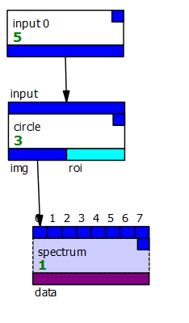

# Using PCOT as a library
As well as being a stand-alone application,
PCOT can be used as a library by other Python programs. This page discusses
three ways to do this, although the various elements can be easily blended
in a single program:

* Loading a PCOT document, reading some data and passing it through
the document's graph;
* Building a PCOT document programmatically and passing data through it;
* Using PCOT functions and data types without a graph.

While the latter two techniques can be useful
for quick ad-hoc work, on the whole we feel it is better to exchange
PCOT documents for traceability and clarity.


## Loading and running PCOT documents

A typical example might be a script
to read a PCOT document and run some data through that document's graph.
You could do that like this:

```python
# This example opens a graph, process some ENVI files through that graph,
# and saves them back to an ENVI. It assumes the graph has an "input 0" node
# which receives an image and a "sink" node which receives the processed
# image.

import pcot
from pcot.document import Document
from pcot.datum import Datum
from pcot.dataformats.envi import write

# initialise PCOT
pcot.setup()

# load the document
doc = Document("1.pcot")

# run the graph for some ENVI files. We'll just do one here, the ENVI
# document contained in the files 1.hdr and 1.dat (an ENVI document
# consists of two files: header and data).

for file in ("1",):

    # load the given ENVI file into input 0
    rv = doc.setInputENVI(0, file+".hdr")
    if rv is not None:
        raise Exception(f"{rv}")

    # run the document's graph 
    doc.run()

    # get the "sink" node
    outNode = doc.getNodeByName("sink")
    
    # get its output
    img = outNode.out.get(Datum.IMG)
 
    # write to new ENVI, e.g. 1b.hdr
    write(file+"b",img)
```

## Building a PCOT document

It's also possible to build a PCOT document, creating nodes within its graph.
Consider the graph



This could be built and run for a particular file with the following code:

```
#!/usr/bin/env python

import pcot
import pcot.document
from pcot.datum import Datum

pcot.setup()

doc = pcot.document.Document()

result = doc.setInputENVI(0, "/home/white/PCOT/fff.hdr") is not None
assert result is not None

# create a document with just an input node in it, to bring that input into the document's graph
innode = doc.graph.create("input 0")

# add a region of interest (ROI) node to the image
roinode = doc.graph.create("circle")
# set the circle to be centred at (32,32) with a radius of 3 pixels
roinode.roi.set(32,32,3)

# connect its first input to the input node's first output
# args: 
#   input on this node to connect
#   node to get connection from
#   index on that node to connect to.
roinode.connect(0,innode,0)     

# connect a node to the ROI node which takes the resulting image-with-ROI
# and plots the spectrum of that ROI

specnode = doc.graph.create("spectrum")
specnode.connect(0,roinode,0)

# run the document
doc.run()

# get the output of the spectrum node, which will be a Datum,
# and dereference the Datum, ensuring that the data is of the right type.
# The result will be a Table object.
output = specnode.getOutput(0, Datum.DATA)

# print the table as CSV.
print(output)
```

## Using PCOT functions and data types without a graph

Often it is much simpler to just use the underlying PCOT data types without a graph.
The operation described in the previous section is an example of this. We could
use the `dataformats.load` package to load the data directly and manipulate it:

```
#!/usr/bin/env python

import pcot
from pcot.datum import Datum
from pcot.dataformats import load
from pcot.rois import ROICircle
from pcot.utils.spectrum import SpectrumSet

pcot.setup()

# load the ENVI file as a Datum object. Will raise an exception
# if there is a problem
datum = load.envi("/home/white/PCOT/fff.hdr")

# retrieve the image, ensuring it's an IMG datum
img = datum.get(Datum.IMG)

# add a region of interest (ROI) node to the image:
# a circle to be centred at (32,32) with a radius of 3 pixels
img.rois.append(ROICircle(32,32,3))

# construct a spectrum set from this image - this can create spectra
# for multiple sources and combine them. Here we are just using a single
# source - the image we are working with - and we're calling it "in."
ss = SpectrumSet({"in": img})

# Generate a table from the results and print it (as a CSV table).
print(ss.table())
```
