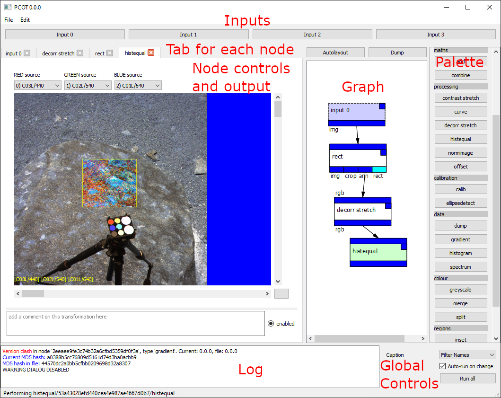

# Getting started with PCOT

## Installation
PCOT is available in two forms:

* **Standalone executables** for Windows and Linux (and hopefully MacOS soon) - these are 
suitable for people who do not need to add their own plugins or use PCOT as a Python library.
They can be obtained from the Aberystwyth team or from the Releases on GitHub.
* **A Python program typically installed with Anaconda and Poetry** which can be obtained by
downloading the source and running the
[installation procedure](index.md#installing-with-anaconda).

## Running the application

* If you are using the standalone version, simply run the executable you downloaded.
* If you installed into an Anaconda environment you should start a command line shell
(an Anaconda Powershell on Windows) and run the following commands:

        conda activate pcot
        pcot
        
## How PCOT works (and why)

PCOT is a tool designed to help scientists and engineers analyse PANCAM data
and produce useful secondary data. It acts downstream from the ROCC on images
which have already been processed to some extent, and is a successor to
ExoSpec. As such, its primary purpose is to generate relative reflectance
images and spectral parameter maps, although it will also be able
to produce spectra from small regions of interest. Indeed, it should
be flexible enough to perform a wide range of unforeseen calculations.

Of paramount importance is the verifiability and reproducibility of data
generated from PCOT. To this end, a PCOT document fully describes how
the data was generated, from the initial import to the final output.

## Introduction to the UI

The image below shows the PCOT interface (with some extra information in red).

The window is divided into several areas:

* At the top, the **input buttons** each open one of PCOT's input windows.
These describe how information is read into PCOT.
* Below this and to the left is the **node tab area**, which will be empty
on startup. Double-clicking on a node in the graph (see below) will
open a tab for that node, allowing you to view it and edit its parameters.
* To the right of the tab area is the **graph**. This shows the nodes in
the document and their connections.
* To the right of the graph is the **palette**. Clicking on a button in
the palette will add a node of the given type to the graph.
* At the bottom is the **log area** and a set of **global controls**.

