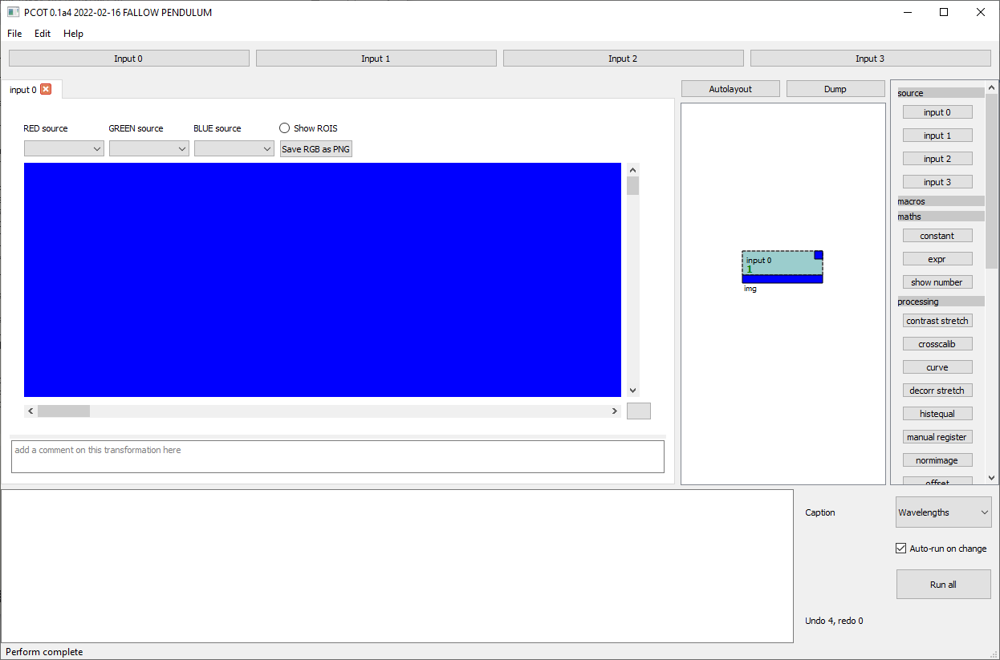
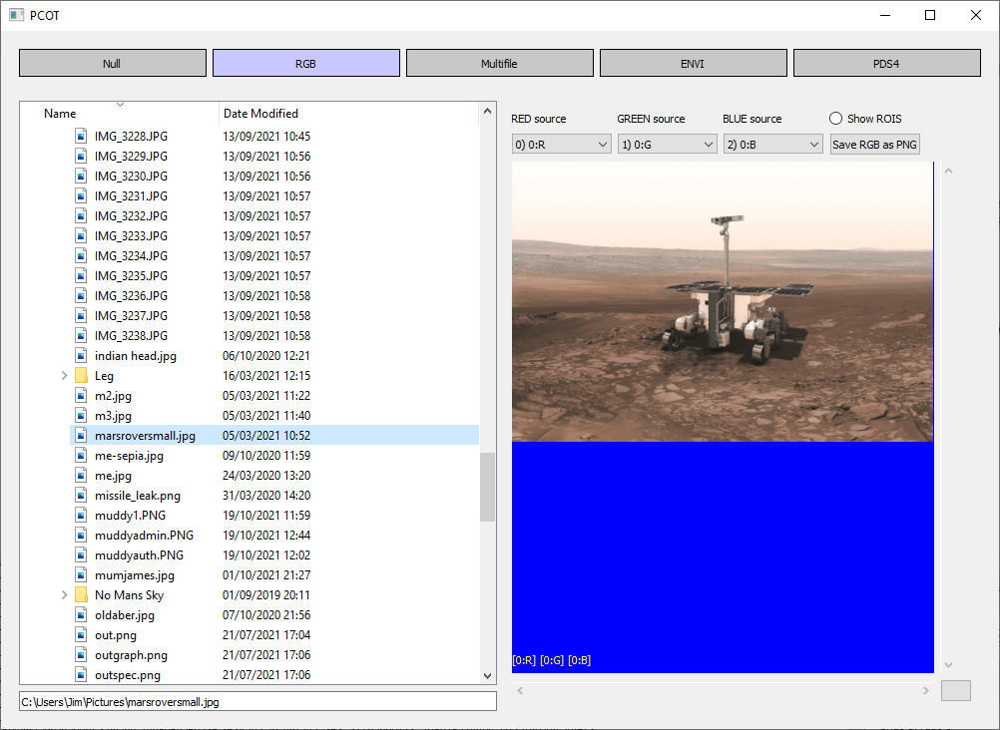

# Getting started with PCOT

<div class="alert alert-danger" role="alert">
Be aware that this is very much an early version and there are 
no doubt a lot of serious problems!
</div>

## Installation
PCOT is available in two forms:

* **Standalone executables** for Windows and Linux (and hopefully MacOS soon) - these are 
suitable for people who do not need to add their own plugins or use PCOT as a Python library.
They can be obtained from the Aberystwyth team or from the Releases on GitHub.
* **A Python program typically installed with Anaconda and Poetry** which can be obtained by
downloading the source and running the
[installation procedure](index.md#installing-with-anaconda).

## Running the application

* If you are using the standalone version, simply run the executable you downloaded.
* If you installed into an Anaconda environment you should start a command line shell
(an Anaconda Powershell on Windows) and run the following commands:

        conda activate pcot
        pcot
        
## Introduction to the UI

The image below shows the PCOT interface (with some extra information in red).


The window is divided into several areas:

* At the top, the **input buttons** each open one of PCOT's input windows.
These describe how information is read into PCOT.
* Below this and to the left is the **node tab area**, which will be empty
on startup. Double-clicking on a node in the graph (see below) will
open a tab for that node, allowing you to view it and edit its parameters.
* To the right of the tab area is the **graph**. This shows the nodes in
the document and their connections.
* To the right of the graph is the **palette**. Clicking on a button in
the palette will add a node of the given type to the graph.
* At the bottom is the **log area** and a set of
[global controls](globalcontrols.md).

### Selecting in the graph

When you open the program, the first thing you will see is a graph containing
a single *input* node, with no nodes open. You can select a node in the graph
by clicking on it, or by dragging a box which intersects the node.
A selected node will be tinted blue.

### Opening a node's tab for editing
Double-clicking on a node will open that node's tab for editing.
If you double-click on the *input* node, it will turn a dark cyan colour
and the node's tab will appear on the left:



The node is cyan because the currently selected tab's node is tinted green,
and the node is already tinted blue because it is selected. There are 
two selection models:

* Multiple nodes can be selected in the graph; these are tinted blue.
* A single node's tab can be open and currently being edited, this node
is tinted green in the graph.
* Nodes which are both being edited and are selected are tinted cyan.

## Canvases

Most nodes use a **canvas** to display some bands of an image as RGB.
This will take up a large proportion of their tab - in some cases
(such as *input*) all of it, with no other controls. It is worth discussing
in some detail.

The main area of the canvas is blue if no image is currently input. 
You can pan the canvas using the scroll bars at the edge, and zoom with
the mouse wheel. The button at bottom right will reset to show the entire
image.


Above the canvas itself are three combo boxes which determine the image
*mapping* : how the bands within the (probably) multispectral image map onto
RGB channels for viewing. Each band in the combo box shows the input number, a
colon, and typically the name, position or wavelength of the band. Exactly
what is shown depends on the image being loaded and the Caption [global
control](globalcontrols.md).

It is also possible to save the RGB-mapped image as a PNG, and show any
regions of interest which have been added to the image.


## Loading an image

For now, we will load an RGB image into PCOT. Clicking on the *Input 0*
button at the top of the main window will open the first of the four
input's editor window. This will show a number of buttons, one for each
input method. Click on RGB, and the window will show that input's 
RGB method settings and select the RGB method as being active (see below).
Using the
directory tree widget, double-click any image file (PNG or RGB). The
canvas on the right-hand side will show the image selected, and you can
modify how the RGB channels are mapped using the three source widgets
as described above. Here, the widgets will just hold "R", "G" and "B"
as the source band names, because this is an RGB image source.




At the bottom right of the image are three **source indicators**: these
show what bands within which inputs were used to generate the canvas
image. They should show something like

    [0:R][0:G][0:B]
    
meaning that the red channel was generated from the band labelled "R" in
input 0, and so on.

## Manipulating an image

Let's perform a simple manipulation on an RGB image. It's not what PCOT
is for, but it will demonstrate some of the principles without requiring
actual multispectral data. In this example, we'll generate a "red/green
slope" image (which is pretty meaningless). 

* Start PCOT and load an image into input 0 as before, by clicking on
the Input 0 button, selecting RGB and double-clicking on an image file.
* Double-click on the *input 0* node in the graph - instances of this node
bring input 0 into the graph.
* Click on *expr* in the palette (on the right) to create an expression
evaluation node.
* Drag a connection from the output of *input 0* to the *a* input
of *expr*
* Double-click on the *expr* node to open its tab for editing

We now have an input feeding into an expression evaluator, which we can
edit. First, let's just see one band.
Click in the *expr* tab's expression box: this is the box which
says "Enter expression here...". Enter the string

    a$R
    
This says "select band *R* from input *a*" - "R" is the name given to
the red channel in RGB images (in multispectral images we typically
use wavelengths on the right-hand side of the ```$``` operator, such as
```a$640```).

Press "Run" in the node's tab. You should now see a monochrome image in the
node's canvas: the result of the calculation, containing only the red channel.
Now change the expression to

    a$R - a$G
    
and press "Run". This will set each pixel to the result of subtracting the
green value for that pixel from the red value, giving us our
"red/green slope." You will probably see quite a
mess, because the canvas expects data between 0 and 1 and some of the pixels
will probably be negative. We need to normalise the image to that range.
Change the expression to 

    norm(a$R - a$G)
    
and press "Run" again to see the final result.

Note that the source indicators in the bottom left of the image are now
displaying something like

    [0:G&0:R][0:G&0:R][0:G&0:R]
    
This indicates that all three RGB channels shown in the canvas are getting
their data from both the R and G bands of input 0.

## Getting help

### Nodes
Get help on a node by double-clicking on the little blue box in the top right
corner of that node in the graph. This text is also available
in the [automatically generated documentation](/autodocs).

### Expressions
Doing the above on an *expr* node will tell you what
operations, functions and properties are available. This text is also
available in the automatically generated [documentation for this
node](/autodocs/expr). 

You can also get help on properties and functions by 
right clicking in the log box at the bottom and selecting the appropriate
option. Inside the expression box in the *expr* node, you can right-click
on most things and ask for help.


## Loading a "multiband" image

TODO

## Other image formats

TODO


