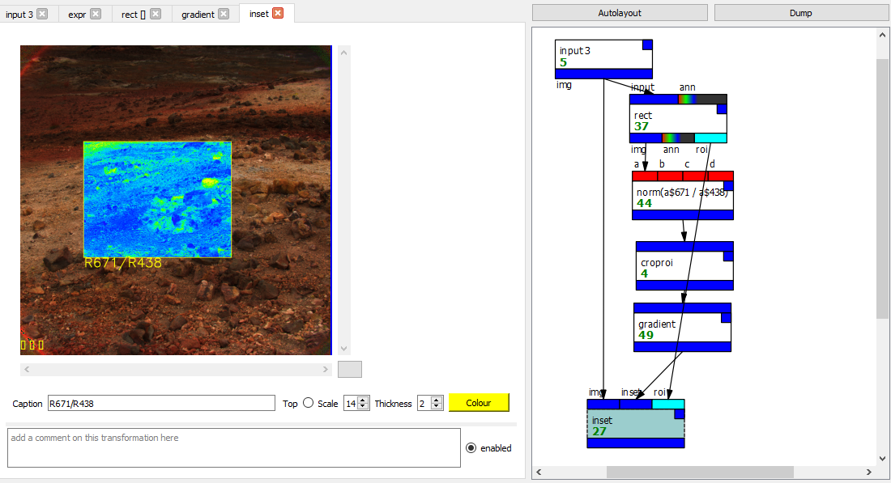
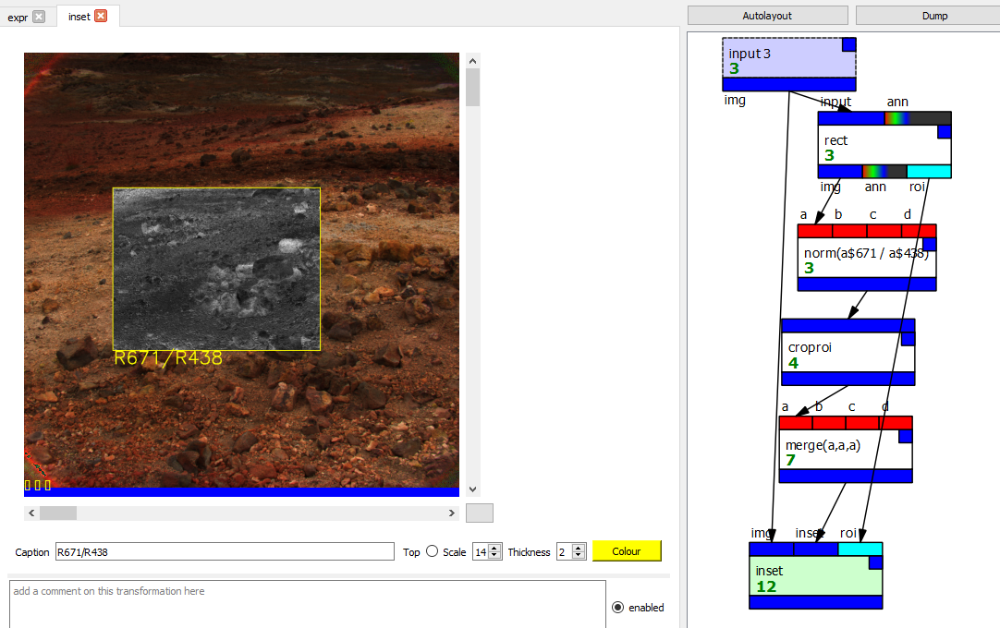
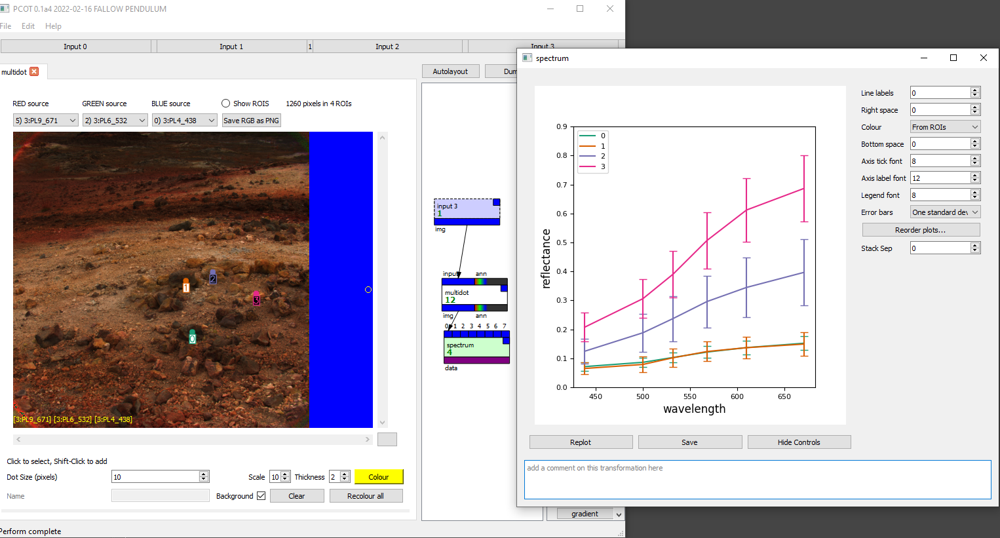

# Getting started with PCOT

<div class="alert alert-danger" role="alert">
Be aware that this is very much an early version and there are 
no doubt a lot of serious problems!
</div>

## Installation
PCOT is available in two forms:

* **Standalone executables** for Windows and Linux (and hopefully MacOS soon) - these are 
suitable for people who do not need to add their own plugins or use PCOT as a Python library.
They can be obtained from the Aberystwyth team or from the Releases on GitHub.
* **A Python program typically installed with Anaconda and Poetry** which can be obtained by
downloading the source and running the
[installation procedure](index.md#installing-with-anaconda).

## Running the application

* If you are using the standalone version, simply run the executable you downloaded.
* If you installed into an Anaconda environment you should start a command line shell
(an Anaconda Powershell on Windows) and run the following commands:

        conda activate pcot
        pcot
        
        
## How PCOT works (and why)

PCOT is a tool designed to help scientists and engineers analyse PANCAM data
and produce useful secondary data. It acts downstream from the ROCC on images
which have already been processed to some extent, and is a successor to
ExoSpec. As such, its primary purpose is to generate relative reflectance
images and spectral parameter maps, although it will also be able
to produce spectra from small regions of interest. Indeed, it should
be flexible enough to perform a wide range of unforeseen calculations.

Of paramount importance is the verifiability and reproducibility of data
generated from PCOT. To this end, a PCOT document fully describes how
the data was generated, from the initial import to the final output.
Users can exchange PCOT documents in addition to, or instead of, the
generated images or data.

### The Graph

To achieve this, a PCOT document manipulates data in a graph - a network of
nodes, each of which takes some data, works on it, perhaps (usually) displays
something, and perhaps outputs some derived data. 
Technically speaking, this is a "directed acyclic graph": each connection
has a direction, going from the output of one node to the input
of another, and there can't be any loops.

As an example, consider that we might want
to overlay some kind of spectral parameter map, converted to a colour
gradient, over an RGB image (note: I'm not a geologist, I'm a software
engineer, so perhaps this is a very artificial example). One way to do it
might be this:



We can see the graph in the panel on the right, showing each node as a box
with connections to other nodes (ignore the green numbers, they just show
how many times each node has run - it's a debugging aid!)
Here's what each node in the graph is doing:

* The *input 3* node reads input number 3 into the graph. The inputs are set up separately from the graph,
and can be multispectral images or other data (e.g. housekeeping) from outside PCOT.
* The *rect* node lets the user draw a rectangle on the image (this is done inside a tab) to define a region of interest. Images
can have many regions of interest.
* The node with 4 inputs *a,b,c,d* is an *expr* node, which is showing the expression it is running: ```norm(a$671 / a$438)```.
This will read the bands whose wavelengths are 671nm and 438nm in the node's *a* input, and find their ratio for every pixel.
It will then normalise the result
to the range [0,1]. The result will be a single-band image. *Expr* nodes can perform much more complex calculations than this.
* The *croproi* node will crop that resulting image to its region of interest - the rectangle we added earlier.
* The *gradient* node will convert a single-band image into an RGB image with a user-defined gradient.
* Finally, the *inset* node will inset this RGB image into an RGB representation of the original image - the mapping of bands in
that image onto RGB is done in the *input* node. A label can be added here.

Of course, if you feel the gradient is rather artificial, the inset can be a just the original band ratio image expanded to RGB 
greyscale using another *expr* node:



Here is another example, showing a spectral plot:

* The *input* node again brings a multispectral image into the graph.
* The *multidot* node adds a number of small, circular regions of interest. Each has a different name and colour, in this case set
automatically to just numbers and random colours. Creating the regions is
as easy as clicking on the image.
* The *spectrum* node plots a spectrogram of the regions present in the image for all the wavelengths in that image.



Here I have "undocked" the *spectrum* node's tab to be a separate window for easy viewing. The spectrum can also be saved as a PDF
or converted into CSV data.

### The Document
A PCOT document consists of 

* The **graph** - a set of nodes and connections between them which define
operations to be performed on inputs, as shown above.
* The **inputs** - data loaded from sources external to PCOT. These are kept
separate from the graph, because you might want to use a different graph on
the same inputs, or the load the same inputs into a different graph. There are
currently up to four inputs, but this can easily be changed. 
* The **settings** - these are global to the entire application.
* **Macros** - these are sets of nodes which can be used multiple times and
appear as single nodes in the graph, although each one has its own "private"
graph.
Currently very experimental (and largely undocumented).

All these are saved inside a document file.


## Introduction to the UI

The image below shows the PCOT interface (with some extra information in red).


The window is divided into several areas:

* At the top, the **input buttons** each open one of PCOT's input windows.
These describe how information is read into PCOT.
* Below this and to the left is the **node tab area**, which will be empty
on startup. Double-clicking on a node in the graph (see below) will
open a tab for that node, allowing you to view it and edit its parameters.
* To the right of the tab area is the **graph**. This shows the nodes in
the document and their connections.
* To the right of the graph is the **palette**. Clicking on a button in
the palette will add a node of the given type to the graph.
* At the bottom is the **log area** and a set of **global controls**.

