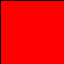
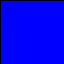
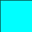
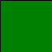
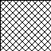
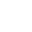
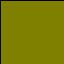

# Connector colours

These are the current node connector colours - this list is subject to change.

|colour/pattern||type|notes|
|-----------|------|-------|----|
|red|{style="margin:0px"}|any type accepted|input only|
|dark blue|{style="margin:0px"}|image||
|cyan|{style="margin:0px"}|region of interest||
|dark green|{style="margin:0px"}|numeric data|scalar or 1D vector|
|crosshatch black|{style="margin:0px"}|variant|output only, used in macros, currently experimental|
|diagonal red|{style="margin:0px"}|none|output only, output type is variable and node has not yet run|
|gold|{style="margin:0px"}|test result|used in unit tests|
|data|{style="margin:0px"}|generic data|e.g. spectra|

