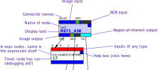
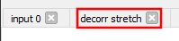
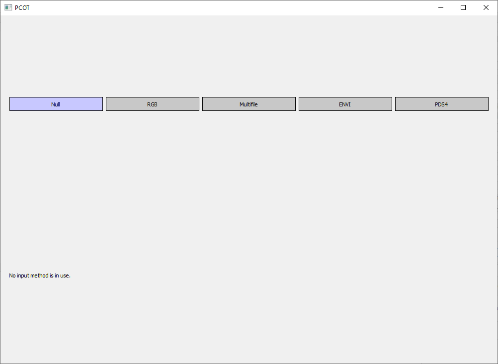
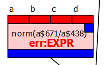
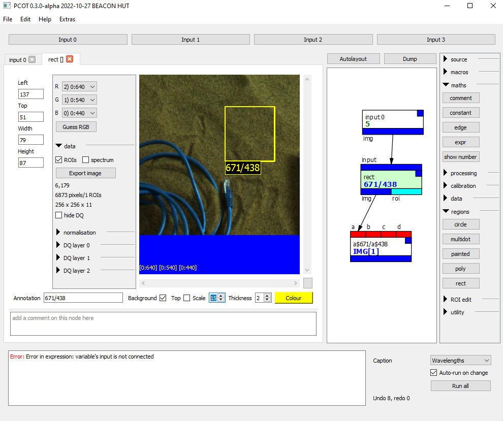
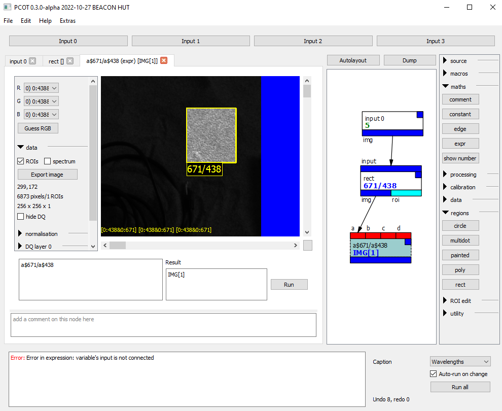
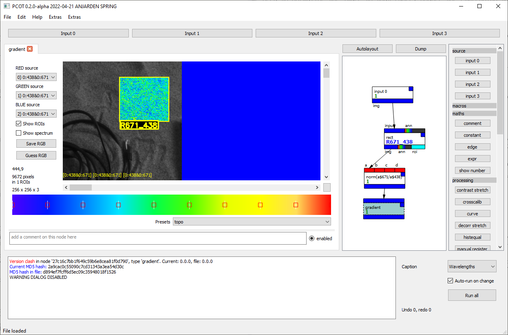
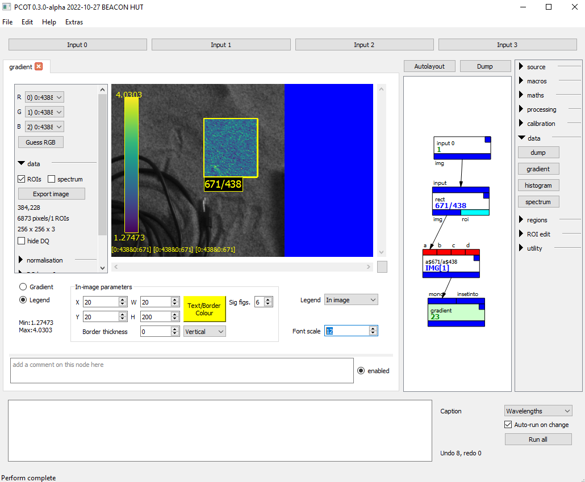
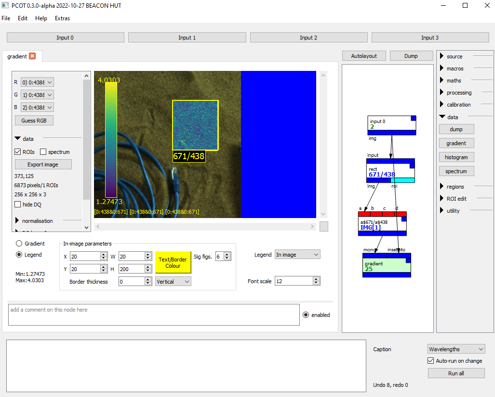
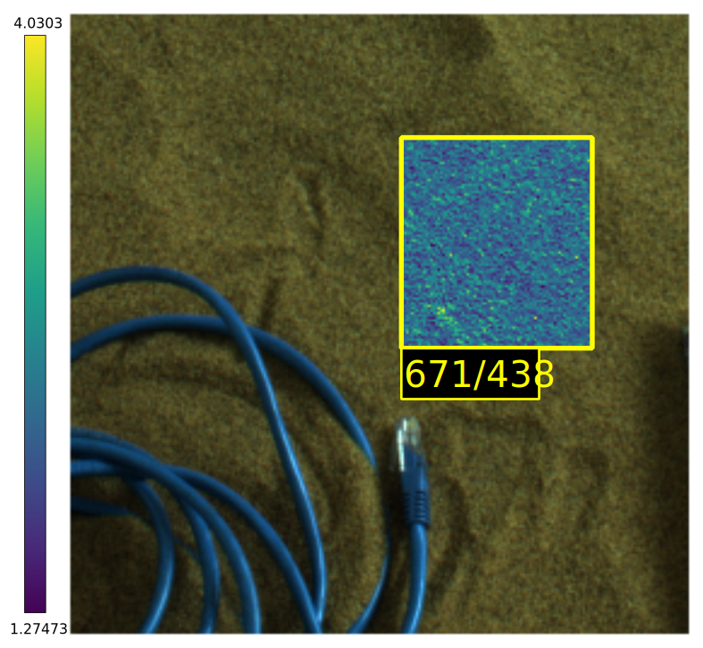

# A first tutorial

This page is a gentle introduction to PCOT's user interface elements,
and will walk you through loading image data and performing some
simple manipulations.

There is also a [video guide](https://www.youtube.com/watch?v=vo5KrOAtMQ8) - 
it may be a little out of date, because development is progressing
quickly but the basics will be the same.

In this document, text written ==with a highlight like this== is
an instruction to follow.


@@@ danger
Be aware that this is very much an early version and there are 
no doubt a lot of serious problems!
@@@

## Preparation
PCOT is primarily designed to work with multispectral images. For this tutorial
we have prepared an image and packaged it with the rest of the system, but you will
need to uncompress it: it's an ENVI image and these can be rather large.
It can be found in the *exampleData* directory
as *obj4-sand-subset.zip*. 

==Uncompress this image somewhere== (perhaps into the same directory) producing two files:
*1.hdr* (the header file) and *1.dat* (the data itself).

This is a 256x256 image with taken using AUPE (Aberystwyth University Pancam Emulator), with 11 bands
of data. It is a subset of a larger image used in testing, and is shown below as an RGB image:


Now you have this image you can ==start PCOT==.

## Introduction to the user interface

The image below shows the PCOT interface when the program has just been started,
with text in red describing
each part.


The window is divided into several areas:

* At the top, the **input buttons** each open one of PCOT's input windows.
These describe how information is read into PCOT.
* Below this and to the left is the **node area**, which will be empty
on startup. Double-clicking on a node in the graph (see below) will
open a detailed view for that node.
You can have several views open in this area looking at different nodes, and 
you can undock by double-clicking on the tab at the top of the view.
* To the right of the node area is the **graph**. This shows the nodes in
the document and their connections. A new document always has an *input 0* node,
which brings input 0 into the graph.
* To the right of the graph is the **palette**, which consists of a number
of sections which can be expanded or hidden. Clicking on a button in
the palette will add a node of the given type to the graph. 
* At the bottom is the **log area**, the **status bar**, and a set of
[global controls](../userguide/globalcontrols.md).

## Working with graph nodes

Each node is shown as a box with input connections on the top and output connections on
the bottom. To illustrate this, consider the following graph you've seen before:


### Node boxes
Looking at a pair of nodes in the graph:


* The inputs and outputs are coloured by type: blue is perhaps the most common and indicates an image. A black band with a tiny
"rainbow" indicates an RGB image. Red means any kind of data can be connected here, and generally only appears
on inputs.
* Inputs and outputs can also have names (but don't always).
* Each node has a help box - double-clicking on this pops up help for the node.
* Each node has a name - usually this is the node's type, but in the case of the *expr* node it is the expression being
calculated (see below).
* Nodes can have a "display text" in blue. These show extra data, such as the output of a calculation in an *expr* node
or the annotation given to a region of interest.
* Currently nodes without a display text also show the number of times they have been calculated as a debugging aid.


### Selecting and opening graph nodes

* You can **select a node** in the graph
by clicking on it, or by dragging a box which intersects the node.
A selected node will be tinted blue.
* You can **open a node** for viewing or editing in the node area by double-clicking.
If you double-click on the *input 0* node, it will turn a dark cyan colour
and a view of the node will appear on the left, along with a tab to select that
view when multiple node views are open.
* You can **close an open node** by clicking on the cross in the node's tab.

==If you open the *input 0*== node in a new document you will see this:


The node is cyan because the current view's node is tinted green,
and the node is already tinted blue because it is selected in the graph. There are 
two selection models:

* Multiple nodes can be selected in the graph; these are tinted blue.
* A single node's view can be open and currently being edited, this node
is tinted green in the graph.
* Nodes which are both being edited and are selected are tinted cyan.

The view for this particular node - *input 0* - shows what external input is currently being
read into PCOT on the input numbered 0. In
this case it shows "None" because there is currently no input. 

### Creating a new node

This can be done in two ways:

* **Clicking on a node type in the palette** will create a new instance of
that type in the graph, hopefully somewhere sensible.
* **Right-clicking a node type from the palette and dragging onto the graph** will create a node
where you wish.

### "Undocking" a node's view


Sometimes it is useful to see several node views at the same time.
Double-clicking on the tab, where the name of the
node type appears, will make the view open in a separate window.
This can be done for several views, and the windows can be rearranged
as you wish. Closing the window will "redock" the view so it appears
in the node area as before.

### Constant and comment nodes

These two nodes are special - the boxes in the graph have text fields
which can be edited.

*  For *constant* nodes, the value in the box 
will be the numeric output of the node. This node has no view, and double-clicking
has no effect.
* For *comment* nodes, the value in the box is a text comment that can help
other users navigate the graph. Once edited, the box can be resized by
clicking and dragging its bottom-right corner. The text will flow to fit
the box. Double-clicking on a *comment* node opens a view which provides
an alternative way of editing the text, as well as changing the font size and
colours. It's also the only way of getting blank lines into the text, since
hitting the "enter" key will stop editing when you are editing the node
text directly in its box.


## Loading an image

The purpose of the *input 0* node is to bring the an input into the graph for manipulation.
As noted [elsewhere](../concepts/), the graph is separate from the inputs. This makes it easier
to run different graphs on the same inputs, or the same graph on different inputs.
==Clicking on the "Input 0" button== at the top of the window will open a window to let us change the
input, which looks like this:



Each input supports a number of *input methods*, only one of which can be active at a time. By
default, the method is *null*, meaning that no data is loaded into that input.

PCOT can support several types of multispectral data file: we will load
a small ENVI image we uncompressed earlier. ==Click on ENVI==, and
the window will show that input's ENVI method settings and select the ENVI
method as being active (see below). 

==Using the directory tree widget, navigate to and double-click the *1.hdr*==
file extracted earlier.
You should see something like this:


The right-hand side is a common component in PCOT known as a
**canvas** which will show the image selected. The canvas
lets you modify how the RGB channels are mapped using the three combo boxes.
Each box gives the band number, the input number and the wavelength. For
example, the red channel is coming from band 2, which is from input 0, and has
a wavelength of 640nm. If the RGB method is used to load an ordinary RGB image
(e.g. from a PNG), the wavelength will not be shown.

The canvas is quite complicated because it does a lot of things, such as
displaying spectra for each pixel,
normalisation settings, and displaying data quality bits. More information
can be found [here](/userguide/canvas).

At the bottom of the image itself are three **source indicators**: these
show what bands within which inputs were used to generate the canvas
image. They should show something like

    [0:640][0:540][0:480]
    
indicating that the red, green and blue channels come from the 640nm, 540nm and 480nm
bands in input 0's image. The source indicator may get quite complex - it shows all inputs that
have had an effect on each channel of the image.


## Manipulating an image: obtaining a spectral parameter map

Let's perform a simple manipulation on an image. Here we will generate
a spectral parameter map from two of the image bands. This parameter is
**R671_438**, the ratio between the 671nm and 438nm bands, which indicates
the presence of ferric minerals[^1].

* ==Start PCOT and load an image into input 0 as before==, by clicking on
the Input 0 button, selecting RGB and double-clicking on an image file.
* ==Double-click on the *input 0* node in the graph== - instances of this node
bring input 0 into the graph.
* ==Open the *maths* section in the palette== by clicking on it.
* ==Click on *expr* in the maths section== to create an expression
evaluation node.
* ==Drag a connection from the output of *input 0* to the *a* input
of *expr*.==
* ==Double-click on the *expr* node to open its view for editing== - this will show an empty
output because our mathematical expression is empty.

We now have an input feeding into an expression evaluator, which we can
edit. First, let's just see one band.
==Click in the *expr* view's expression box==: this is the box which
says "Enter expression here...".

==Enter the string==

    a$671
    
This says "select the band with centre wavelength 671nm from input *a*".

==Press "Run" in the node's view==. You should now see a monochrome image in the
node's canvas: the result of the calculation, containing only that single band.

==Now change the expression to==

    a$671/a$438
    
==and press "Run"== to see the result, which should be this:


Note that the source indicators in the bottom left of the image are now
displaying

    [0:438&0:671] [0:438&0:671] [0:438&0:671]
    
This indicates that all three RGB channels shown in the canvas are getting
their data from the 438 and 671 bands of input 0.

### Disconnecting nodes and node error states
==Disconnect the input node== by dragging the arrowhead from the *a* box and releasing it in empty space. This will cause an error:


The EXPR is the kind of error - EXPR is an error in expression
parsing/execution. More details can be seen in the log window, which in this
case reads 

```txt
Error in expression: variable's input is not connected
```
This is because there is no longer an image feeding into the *expr* node's input for variable *a*.
Now ==reconnect the input node to the *expr* node== to fix the error.

### Adding a region of interest

It's a little hard to see what's going on, so we will add a region of interest.
This will make the *expr* node treat the operation differently - only the area inside
the rectangle will be ```norm(a$671/a$438)```.
Everywhere
else in the image, the output will come from the left-hand side of the expression (the 671nm channel).
The rules for ROIs are explained more fully [on this page](../../userguide/principles).

==Open the *regions* section of the palette and add a *rect* node between the *input* and *expr* nodes==
(the latter of which will be
labelled with its expression). Nothing will change, because the rectangle has not been set.
==Edit the *rect* node and draw a rectangle by clicking and dragging on the canvas.==
==Set the scale to 5 pixels and type "671_438" in the Annotation box==, something like this:



Now the *expr* node shows this - only the rectangle has the 671/438 parameter, while the rest of
the image shows the 671nm band. To see this, ==click on the *expr* tab==:



The image is dark, because the values of the parameter shown in the rectangle are much greater
than those of the 671nm band.

It can be hard to adjust the rectangle when you can't see what's happening in the final image -
==try undocking the *rect* node and dragging it to a different part of the screen== by double-clicking
on the tab, so you can edit
the rectangle while the *expr* output is visible. ==Dock it again by closing the undocked window==.

To make things more visible still, ==open the *data* section and add a *gradient* node after the *expr* node and view it==, clicking
making sure **Show ROIs** is enabled on its canvas (ROIs are typically retained on derived
images):



There's not much to see because of the nature of the image, unfortunately! Note that there is a "legend"
at top left, and this can be ==edited and placed by clicking on the Legend button==:



The colour palette for the gradient, incidentally, is the "viridis" palette which is helpful for people
with certain kinds of colour blindness[^2]. Other presets are available
by clicking on the **Load Preset** button, or you can edit the gradient
by hand: double-click to add or remove a point, drag to move a point.


It is possible to "inset" the gradient into the RGB representation used in the *input* node by passing
that to the *insetinto* input of the gradient:



If you ==switch to the Legend part of the *gradient* node== and
==select *Left margin* for the **Legend** item==, when you ==export the image==
with the canvas' Export Image button the legend will be in the margin:




[^1]:
Allender, E. J., C. R. Cousins, M. D. Gunn, and C. M. Caudill.
["Multiscale and multispectral characterization of mineralogy with the ExoMars 2022 rover
remote sensing payload."](https://agupubs.onlinelibrary.wiley.com/doi/full/10.1029/2019EA000692)
*Earth and Space Science* 7, no. 4 (2020): e2019EA000692.


[^2]:
Simon Garnier, Noam Ross, Robert Rudis, Antônio P. Camargo, Marco Sciaini, and Cédric Scherer (2021). viridis(Lite) - Colorblind-Friendly Color Maps for R. viridis package version 0.6.2.
