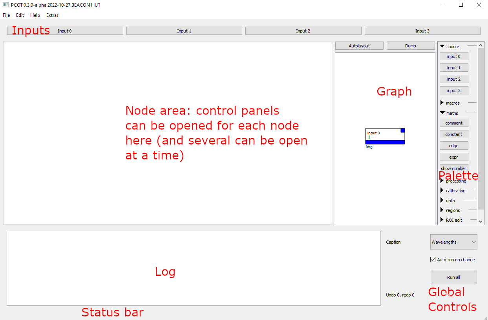

# A first tutorial

This page is a gentle introduction to PCOT's user interface elements,
and will walk you through loading image data and performing some
simple manipulations.

There is a [video guide](https://www.youtube.com/watch?v=vo5KrOAtMQ8) - 
it may be a little out of date, because development is progressing
quickly but the basics will be the same
(this also applies to this document).


@@@ danger
Be aware that this is very much an early version and there are 
no doubt a lot of serious problems!
@@@
        
## Introduction to the UI

The image below shows the PCOT interface with text in red describing
each part.



The window is divided into several areas:

* At the top, the **input buttons** each open one of PCOT's input windows.
These describe how information is read into PCOT.
* Below this and to the left is the **node area**, which will be empty
on startup. Double-clicking on a node in the graph (see below) will
open a detailed view for that node.
You can have several views open in this area looking at different nodes, and 
you can undock by double-clicking on the tab at the top of the view.
* To the right of the node area is the **graph**. This shows the nodes in
the document and their connections.
* To the right of the graph is the **palette**. Clicking on a button in
the palette will add a node of the given type to the graph.
* At the bottom is the **log area**, the **status bar**, and a set of
[global controls](../userguide/globalcontrols.md).

## Working with graph nodes

### Selecting in the graph

When you open the program, the first thing you will see is a graph containing
a single *input* node, with no nodes open. You can select a node in the graph
by clicking on it, or by dragging a box which intersects the node.
A selected node will be tinted blue.

### Opening a node for editing
Double-clicking on a node will open that node for editing.
If you double-click on the *input* node, it will turn a dark cyan colour
and a view of the node will appear on the left, along with a tab to select that
view when multiple node views are open:


The node is cyan because the current view's node is tinted green,
and the node is already tinted blue because it is selected in the graph. There are 
two selection models:

* Multiple nodes can be selected in the graph; these are tinted blue.
* A single node's view can be open and currently being edited, this node
is tinted green in the graph.
* Nodes which are both being edited and are selected are tinted cyan.

The view for this particular node - *input 0* - shows what external input is currently being
read into PCOT on the input numbered 0. In
this case it shows "None" because there is currently no input. 

### Creating a new node

This can be done in two ways:

* **Clicking on a node type in the palette** will create a new instance of
that type in the graph, hopefully somewhere sensible.
* **Right-clicking a node type from the palette and dragging onto the graph** will create a node
where you wish.

### "Undocking" a node's view


Sometimes it is useful to see several node views at the same time.
Double-clicking on the tab, where the name of the
node type appears, will make the view open in a separate window.
This can be done for several views, and the windows can be rearranged
as you wish. Closing the window will "redock" the view so it appears
in the node area as before.

### Constant and comment nodes

These two nodes are special - the boxes in the graph have text fields
which can be edited.

*  For *constant* nodes, the value in the box 
will be the numeric output of the node. This node has no view, and double-clicking
has no effect.
* For *comment* nodes, the value in the box is a text comment that can help
other users navigate the graph. Once edited, the box can be resized by
clicking and dragging its bottom-right corner. The text will flow to fit
the box. Double-clicking on a *comment* node opens a view which provides
an alternative way of editing the text, as well as changing the font size and
colours. It's also the only way of getting blank lines into the text, since
hitting the "enter" key will stop editing when you are editing the node
text directly in its box.


## Loading an image

While PCOT can support several types of multispectral data file, we will load
an RGB image into PCOT for now. Clicking on the *Input 0* button at the top of
the main window will open the first of the four input's editor window. This
will show a number of buttons, one for each input method. Click on RGB, and
the window will show that input's RGB method settings and select the RGB
method as being active (see below). Using the directory tree widget,
double-click any image file (PNG or RGB). The right-hand side is a common component in PCOT
known as a "canvas", which will show the
image selected. The canvas lets you modify how the RGB channels are mapped using the
three combo boxes. Here, they will just hold "R", "G" and "B" as the source
band names because this is an RGB image source.


At the bottom of the image are three **source indicators**: these
show what bands within which inputs were used to generate the canvas
image. They should show something like

    [0:R][0:G][0:B]
    
meaning that the red channel was generated from the band labelled "R" in
input 0, and so on.


## Canvases

Most nodes use a **canvas** to display some bands of an image as RGB.
This will take up a large proportion of their view - in some cases
all of it - with no other controls. It is worth discussing
in some detail. A canvas is shown in the previous section as the right-hand
side of an input widget. Another is shown below as the entire control area
for an actual *input* node, which brings one of the four inputs into
the graph.


You can pan the canvas using the scroll bars at the edge, and zoom with
the mouse wheel. The button at bottom right will reset to show the entire
image.

To the left of the canvas image itself are three combo boxes which determine
the image *mapping* : how the bands within the (probably) multispectral image
map onto RGB channels for viewing. Each band in the combo box shows the input
number, a colon, and typically the name, position or wavelength of the band.
Exactly what is shown depends on the image being loaded and the Caption
[global control](../userguide/globalcontrols.md).

Below this are some assorted controls:

* **Show ROIs** will mark any regions of interest the image has - these
are added using nodes like *rect* (for a rectangle) and are carried forward
through subsequent nodes (where appropriate), delimiting the area upon
which calculations are performed. They also control the regions used
for calculating spectra. Normally an ROI is only shown in the node which adds
it.
* **Show spectrum** opens a side pane, and dragging the cursor across the
image will plot the spectrum of the pixel under the cursor in this pane. If
no filter wavelengths are available, a list of the values for each band
is shown.
* **Save RGB** saves the RGB-mapped image as a PNG.
* **Guess RGB** tries to guess appropriate channels for the RGB canvas image.

@@@warning
The canvas is going to get a lot more complex in the next release,
because it needs to show image quality and uncertainty data for each band.
This information will be moved into [its own page](../userguide/canvas.md)
@@@

## Manipulating an image

Let's perform a simple manipulation on an RGB image. It's not what PCOT
is for, but it will demonstrate some of the principles without requiring
actual multispectral data. In this example, we'll generate a "red/green
slope" image (which is pretty meaningless). 

* Start PCOT and load an image into input 0 as before, by clicking on
the Input 0 button, selecting RGB and double-clicking on an image file.
* Double-click on the *input 0* node in the graph - instances of this node
bring input 0 into the graph.
* Click on *expr* in the palette (on the right) to create an expression
evaluation node.
* Drag a connection from the output of *input 0* to the *a* input
of *expr*
* Double-click on the *expr* node to open its view for editing

We now have an input feeding into an expression evaluator, which we can
edit. First, let's just see one band.
Click in the *expr* view's expression box: this is the box which
says "Enter expression here...". Enter the string

    a$R
    
This says "select band *R* from input *a*" - "R" is the name given to
the red channel in RGB images (in multispectral images we typically
use wavelengths on the right-hand side of the ```$``` operator, such as
```a$640```).

Press "Run" in the node's view. You should now see a monochrome image in the
node's canvas: the result of the calculation, containing only the red channel.
Now change the expression to

    a$R - a$G
    
and press "Run". This will set each pixel to the result of subtracting the
green value for that pixel from the red value, giving us our
"red/green slope." You will probably see quite a
mess, because the canvas expects data between 0 and 1 and some of the pixels
will probably be negative. We need to normalise the image to that range.
Change the expression to 

    norm(a$R - a$G)
    
and press "Run" again to see the final result.

Note that the source indicators in the bottom left of the image are now
displaying something like

    [0:G&0:R][0:G&0:R][0:G&0:R]
    
This indicates that all three RGB channels shown in the canvas are getting
their data from both the R and G bands of input 0.

The end result should look something like this:


## Getting help

### Nodes
Inside the PCOT app there are three ways to get help on a node:

* Double-clicking on the little blue box in the top right
corner of that node in the graph,
* Using the right-click context menu on a node,
* Using the right-click context menu on a button in the palette.

The node help texts are also available
in the [automatically generated documentation](/autodocs). If this isn't
enough, don't hesitate to contact the Aberystwyth team.

### Expressions
Doing the above on an *expr* node will tell you what
operations, functions and properties are available. This text is also
available in the automatically generated [documentation for this
node](/autodocs/expr). 

You can also get help on properties and functions by 
right clicking in the log box at the bottom and selecting the appropriate
option. Inside the expression box in the *expr* node, you can right-click
on most things and ask for help.

## Loading different image formats

The examples above use RGB images, which aren't much use for real work.
Other image formats are available:

* ENVI images
* "multiband" images (multiple monochrome PNG images, one per band)
* PDS4 products (work in progress)

### Loading an ENVI image
ENVI images consists of a header (.hdr) file and the actual data (.dat) file. Currently PCOT can only load
ENVI files which are 32-bit floating point, BSQ (band sequential) interleaved. To load ENVI, open an input
and click the ENVI button. A dialog will appear which is very similar to the [RGB file dialog above](#inputrgb), 
but showing ENVI header files instead of image files. Double-click on such a file to load its associated data,
which is assumed to be in the same directory with the same name. Filter name and wavelength information will be taken
from the file.

### Loading a "multiband" image

Sometimes data is provided as a set of monochrome PNG files, although this is clearly far from ideal.
In this case we need to tell PCOT how to work out which filter is being used for each file. Again, we open
the dialog by clicking on an input button and clicking the appropriate method - "Multifile" in this case. This
will open the ENVI dialog, which is rather more complex than the RGB or ENVI dialogs:


The procedure here is roughly this:

* Make sure the file names contain the the lens (left or right) as L or R,
and the filter position number.
* Work out a regular expression which can find these in the file name.
Hopefully you can just use the default, which assumes that the filename 
contains a string like ```LWAC01``` for left lens, position 01; or
```RWAC10``` for right lens, position 10. If your filenames don't have this
format and it's too difficult to rename them, you'll have to write
an RE yourself or find a handy IT person to help.
* Get the files into a single directory and open the input dialog as shown
above.
* Determine which camera configuration - PANCAM or AUPE - produced the
images and set the Camera option accordingly. These two setups use
different filter sets, and will translate filter positions into different
filter wavelengths and names.
* Click the "Get Directory" button.
* In the new dialog, select a directory containing the ENVI .hdr files and
their accompanying .dat files, and click "Select Folder".
* A lot of files will appear in the Files box.
* Double-click images to preview them as a single channel.
If they are dark, select an appropriate multiplier and double-click again.
* Click in image checkboxes to select them; selected images will be combined into a single multispectral mage.

Close the dialog when you have the selected images you want. It might be a good idea to create an *input* node
to examine the resulting multispectral image.

### PDS4 products

This is very much work in progress - please contact the developers if you need
this functionality soon.
