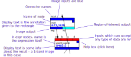
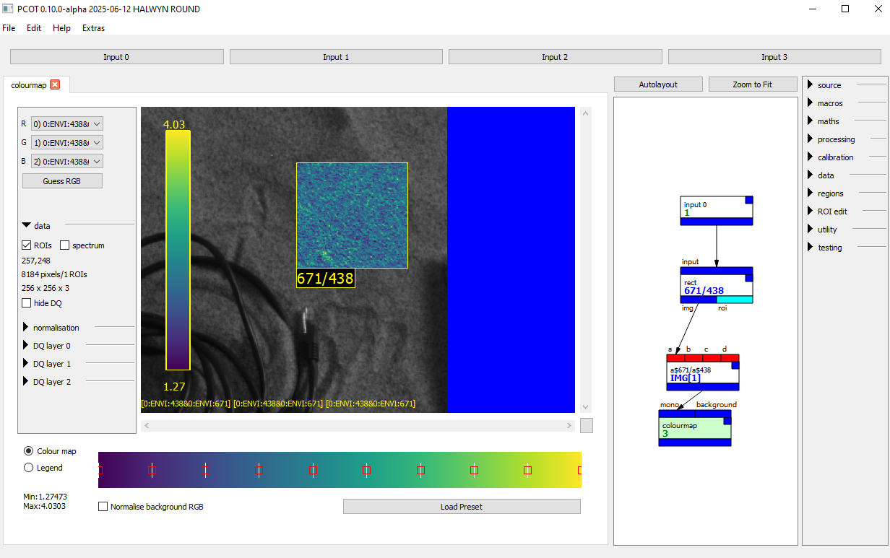
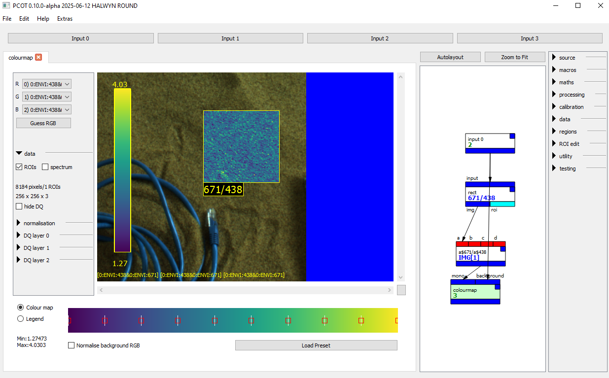

# A first tutorial

This page is a gentle introduction to PCOT's user interface elements,
and will walk you through loading image data and performing some
simple manipulations.

There is also a [video guide](https://www.youtube.com/watch?v=vo5KrOAtMQ8) - 
it may be a little out of date, because development is progressing
quickly but the basics will be the same.


@@@ danger
Be aware that this is very much an early version and there are 
no doubt a lot of serious problems!
@@@

## Preparation
PCOT is primarily designed to work with multispectral images. For this tutorial
we have prepared an image and packaged it with the rest of the system, but you will
need to uncompress it: it's an ENVI image and these can be rather large.
It can be found in the **exampleData** directory
as **obj4-sand-subset.zip**. Uncompress it somewhere (perhaps into the same directory) producing two files:
**1.hdr** (the header file) and **1.dat** (the data itself).

This is a 256x256 image with taken using AUPE (Aberystwyth University Pancam Emulator), with 11 bands
of data. It is a subset of a larger image used in testing, and is shown below as an RGB image:


Now you have this image you can start PCOT.

## Introduction to the user interface

The image below shows the PCOT interface when the program has just been started,
with text in red describing
each part.


The window is divided into several areas:

* At the top, the **input buttons** each open one of PCOT's input windows.
These describe how information is read into PCOT.
* Below this and to the left is the **node area**, which will be empty
on startup. Double-clicking on a node in the graph (see below) will
open a detailed view for that node.
You can have several views open in this area looking at different nodes, and 
you can undock by double-clicking on the tab at the top of the view.
* To the right of the node area is the **graph**. This shows the nodes in
the document and their connections. A new document always has an *input 0* node,
which brings input 0 into the graph.
* To the right of the graph is the **palette**, which consists of a number
of sections which can be expanded or hidden. Clicking on a button in
the palette will add a node of the given type to the graph. 
* At the bottom is the **log area**, the **status bar**, and a set of
[global controls](../userguide/globalcontrols.md).

## Working with graph nodes

Each node is shown as a box with input connections on the top and output connections on
the bottom. To illustrate this, consider the following graph you've seen before:


### Node boxes
Looking at a pair of nodes in the graph:


* The inputs and outputs are coloured by type: blue is perhaps the most common and indicates an image. A black band with a tiny
"rainbow" indicates an RGB image. Red means any kind of data can be connected here, and generally only appears
on inputs.
* Inputs and outputs can also have names (but don't always).
* Each node has a help box - double-clicking on this pops up help for the node.
* Each node has a name - usually this is the node's type, but in the case of the *expr* node it is the expression being
calculated (see below).
* Nodes can have a "display text" in blue. These show extra data, such as the output of a calculation in an *expr* node
or the annotation given to a region of interest.
* Currently nodes without a display text also show the number of times they have been calculated as a debugging aid.


### Selecting and opening graph nodes

* You can **select a node** in the graph
by clicking on it, or by dragging a box which intersects the node.
A selected node will be tinted blue.
* You can **open a node** for viewing or editing in the node area by double-clicking.
If you double-click on the *input 0* node, it will turn a dark cyan colour
and a view of the node will appear on the left, along with a tab to select that
view when multiple node views are open.
* You can **close an open node** by clicking on the cross in the node's tab.

If you open the *input 0* node in a new document you will see this:


The node is cyan because the current view's node is tinted green,
and the node is already tinted blue because it is selected in the graph. There are 
two selection models:

* Multiple nodes can be selected in the graph; these are tinted blue.
* A single node's view can be open and currently being edited, this node
is tinted green in the graph.
* Nodes which are both being edited and are selected are tinted cyan.

The view for this particular node - *input 0* - shows what external input is currently being
read into PCOT on the input numbered 0. In
this case it shows "None" because there is currently no input. 

### Creating a new node

This can be done in two ways:

* **Clicking on a node type in the palette** will create a new instance of
that type in the graph, hopefully somewhere sensible.
* **Right-clicking a node type from the palette and dragging onto the graph** will create a node
where you wish.

### "Undocking" a node's view


Sometimes it is useful to see several node views at the same time.
Double-clicking on the tab, where the name of the
node type appears, will make the view open in a separate window.
This can be done for several views, and the windows can be rearranged
as you wish. Closing the window will "redock" the view so it appears
in the node area as before.

### Constant and comment nodes

These two nodes are special - the boxes in the graph have text fields
which can be edited.

*  For *constant* nodes, the value in the box 
will be the numeric output of the node. This node has no view, and double-clicking
has no effect.
* For *comment* nodes, the value in the box is a text comment that can help
other users navigate the graph. Once edited, the box can be resized by
clicking and dragging its bottom-right corner. The text will flow to fit
the box. Double-clicking on a *comment* node opens a view which provides
an alternative way of editing the text, as well as changing the font size and
colours. It's also the only way of getting blank lines into the text, since
hitting the "enter" key will stop editing when you are editing the node
text directly in its box.


## Loading an image

The purpose of the *input 0* node is to bring the an input into the graph for manipulation.
As noted [elsewhere](../concepts/), the graph is separate from the inputs. This makes it easier
to run different graphs on the same inputs, or the same graph on different inputs.
Clicking on the "Input 0" button at the top of the window will open a window to let us change the
input, which looks like this:


Each input supports a number of *input methods*, only one of which can be active at a time. By
default, the method is *null*, meaning that no data is loaded into that input.

PCOT can support several types of multispectral data file: we will load
a small ENVI image we uncompressed earlier. Click on ENVI, and
the window will show that input's ENVI method settings and select the ENVI
method as being active (see below). 

Using the directory tree widget, navigate to and double-click the **1.hdr** file extracted earlier.
You should see something like this:


The right-hand side is a common component in PCOT
known as a "canvas", which will show the
image selected. The canvas lets you modify how the RGB channels are mapped using the
three combo boxes. Each box gives the band number, the input number and the wavelength. For example,
the red channel is coming from band 2, which is from input 0, and has a wavelength of 640nm.
If the RGB method is used to load an ordinary RGB image (e.g. from a PNG), the wavelength will
not be shown.


At the bottom of the image itself are three **source indicators**: these
show what bands within which inputs were used to generate the canvas
image. They should show something like

    [0:640][0:540][0:480]
    
indicating that the red, green and blue channels come from the 640nm, 540nm and 480nm
bands in input 0's image. The source indicator may get quite complex - it shows all inputs that
have had an effect on each channel of the image.

## Canvases

Most nodes use a **canvas** to display some bands of an image as RGB.
This will take up a large proportion of their view - in some cases
all of it. It is worth discussing
in some detail. A canvas is shown in the previous section as the right-hand
side of an input widget. Another is shown below as the entire control area
for an actual *input* node, which brings one of the four inputs into
the graph.


You can pan the canvas using the scroll bars at the edge, and zoom with
the mouse wheel. The button at bottom right will reset to show the entire
image.

To the left of the canvas image itself are three combo boxes which determine
the image *mapping* : how the bands within the (probably) multispectral image
map onto RGB channels for viewing. Each band in the combo box shows the input
number, a colon, and typically the name, position or wavelength of the band.
Exactly what is shown depends on the image being loaded and the Caption
[global control](../userguide/globalcontrols.md).

Below this are some assorted controls:

* **Show ROIs** will mark any regions of interest the image has - these
are added using nodes like *rect* (for a rectangle) and are carried forward
through subsequent nodes (where appropriate), delimiting the area upon
which calculations are performed. They also control the regions used
for calculating spectra. Normally an ROI is only shown in the node which adds
it.
* **Show spectrum** opens a side pane, and dragging the cursor across the
image will plot the spectrum of the pixel under the cursor in this pane. If
no filter wavelengths are available, a list of the values for each band
is shown.
* **Save RGB** saves the RGB-mapped image as a PNG.
* **Guess RGB** tries to guess appropriate channels for the RGB canvas image.

The show spectrum pane looks like this:


When a spectrum view is opened the image pane can be tiny - to fix this you
can resize the PCOT window (or undocked node window), or drag the separator
between the image and the spectrum (the two vertical bars). Each dot is shown
with an approximation of its wavelength colour (using [Dan Bruton's
algorithm](http://www.physics.sfasu.edu/astro/color/spectra.html)) or black if
the wavelength is not visible.

@@@warning
The canvas is going to get a lot more complex in the next release,
because it needs to show image quality and uncertainty data for each band.
This information will be moved into [its own page](../userguide/canvas.md)
@@@

## Manipulating an image: obtaining a spectral parameter map

Let's perform a simple manipulation on an image. Here we will generate
a spectral parameter map from two of the image bands. This parameter is
**R671_438**, the ratio between the 671nm and 438nm bands, which indicates
the presence of ferric minerals[^1].

* Start PCOT and load an image into input 0 as before, by clicking on
the Input 0 button, selecting RGB and double-clicking on an image file.
* Double-click on the *input 0* node in the graph - instances of this node
bring input 0 into the graph.
* Click on *expr* in the palette (on the right) to create an expression
evaluation node.
* Drag a connection from the output of *input 0* to the *a* input
of *expr*.
* Double-click on the *expr* node to open its view for editing - this will show an empty
output because our mathematical expression is empty.

We now have an input feeding into an expression evaluator, which we can
edit. First, let's just see one band.
Click in the *expr* view's expression box: this is the box which
says "Enter expression here...". Enter the string

    a$671
    
This says "select the band with centre wavelength 671nm from input *a*".

Press "Run" in the node's view. You should now see a monochrome image in the
node's canvas: the result of the calculation, containing only that single band.
Now change the expression to

    a$671/a$438
    
and press "Run". You will see a largely white image, because the canvas
expects data between 0 and 1 (future versions of the canvas will show this saturation
more clearly).
We need to normalise the image to that range. Change the expression to 

    norm(a$671/a$438)
    
and press "Run" again to see the result, which should be this:


Note that the source indicators in the bottom left of the image are now
displaying

    [0:438&0:671] [0:438&0:671] [0:438&0:671]
    
This indicates that all three RGB channels shown in the canvas are getting
their data from the 438 and 671 bands of input 0.

### Disconnecting nodes and node error states
Disconnect the input node by dragging the arrowhead from the *a* box and releasing it in empty space. This will cause an error:


The EXPR is the kind of error - EXPR is an error in expression parsing/execution. More details can be seen in the log window,
which in this case reads 

```
Error in expression: cannot perform binary operation on None image
```
This is because there is no longer an image feeding into the *expr* node, so the binary ```$``` operation cannot run.


### Adding a region of interest

It's a little hard to see what's going on, so we will add a region of interest.
This will make the *expr* node treat the operation differently - only the area inside
the rectangle will be ```norm(a$671/a$438)```.
Everywhere
else in the image, the output will come from the left-hand side of the expression (the 671nm channel).
The rules for ROIs are explained more fully [on this page](../../userguide/principles).

Add a *rect* node between the *input* and *expr* nodes (the latter of which will be
labelled with its expression). Nothing will change, because the rectangle has not been set.
Edit the *rect* node and draw a rectangle by clicking and dragging on the canvas.
Set the scale to 5 pixels and type "R671_438" in the Annotation box, something like this:


Now the *expr* node shows this - only the rectangle has the parameter, while the rest of
the image shows the 671nm band. To see this, click on the *expr* tab:


This means that we're normalising a much narrower range to 0-1. 
It can be hard to adjust the rectangle when you can't see what's happening in the final image -
try undocking the *rect* node and dragging it to a different part of the screen, so you can edit
the rectangle while the *expr* output is visible.

To make things more visible still, add a *gradient* node after the *expr* node and view it, clicking
on the Show ROIs button to make any ROIs on the image visible (ROIs are typically retained on derived
images):


There's not much to see because of the nature of the image, unfortunately! Note that there is a "legend"
at top left, and this can be edited and placed by clicking on the Legend button:




It is possible to "inset" the gradient into the RGB representation used in the *input* node by passing
that to the *insetinto* input of the gradient:



Finally, the gradient node will automatically normalise its data to a range. That makes the *norm* function
used in the expression redundant. We can remove it, and we'll see the full range on the legend:


@@@alert
Note that the positioning of the legend text is slightly off; we'll fix that.
@@@

It is also possible to export the data as a PDF, SVG or PNG with the legend in the margin:


[^1]:
Allender, E. J., C. R. Cousins, M. D. Gunn, and C. M. Caudill.
["Multiscale and multispectral characterization of mineralogy with the ExoMars 2022 rover
remote sensing payload."](https://agupubs.onlinelibrary.wiley.com/doi/full/10.1029/2019EA000692)
*Earth and Space Science* 7, no. 4 (2020): e2019EA000692.
