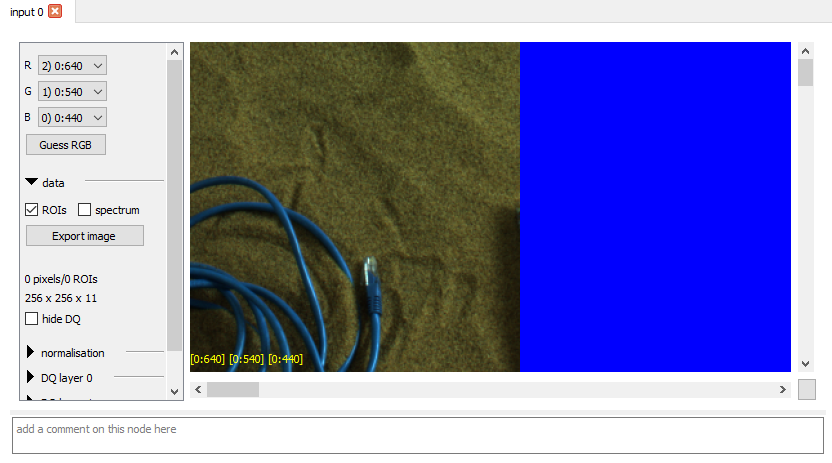
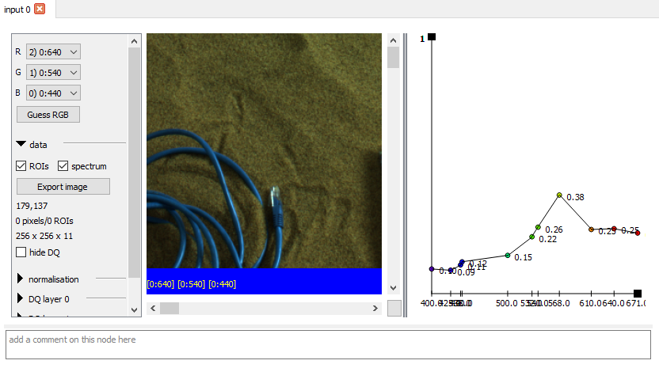

# The Canvas and its optional views

Most nodes and inputs use a **canvas** to display some bands of an image as
RGB. This will take up a large proportion of their view - in some cases all of
it. It is worth discussing in some detail. A canvas is shown below as the
entire control area for an  *input* node, which brings one of the four
inputs into the graph.

You can pan the canvas using the scroll bars at the edge, and zoom with
the mouse wheel. The button at bottom right will reset to show the entire
image.

To the left of the canvas image itself is the canvas control area. This has quite a lot
in it, so is scrollable with collapsible sections, rather like the palette.

At the top - and not collapsible - are three combo boxes which determine
the image *mapping* : how the bands within the (probably) multispectral image
map onto RGB channels for viewing. Each band in the combo box shows the input
number (i.e. which of the four global inputs the data is sourced from),
a colon, and typically the name, position or wavelength of the band.
Exactly what is shown depends on the image being loaded and the Caption
[global control](../userguide/globalcontrols.md).
The **Guess RGB** button tries to guess appropriate channels for the RGB canvas image.

## Data section
This is the first of the collapsible sections.

* **Show ROIs** will mark any regions of interest the image has - these
are added using nodes like *rect* (for a rectangle) and are carried forward
through subsequent nodes (where appropriate), delimiting the area upon
which calculations are performed. They also control the regions used
for calculating spectra. Normally an ROI is only shown in the node which adds
it.
* **Show spectrum** opens a side pane, and dragging the cursor across the
image will plot the spectrum of the pixel under the cursor in this pane. If
no filter wavelengths are available, a list of the values for each band is shown.
The show spectrum pane looks like this:

The screenshot isn't showing the cursor, unfortunately, but the spectrum is for
the pixel under the cursor.

When a spectrum view is opened the image pane can be tiny - to fix this you
can resize the PCOT window (or undocked node window), or drag the separator
between the image and the spectrum (the two vertical bars). Each dot is shown
with an approximation of its wavelength colour (using [Dan Bruton's
algorithm](http://www.physics.sfasu.edu/astro/color/spectra.html)) or black if
the wavelength is not visible.

* **Export image** saves the RGB-mapped image as a PDF, SVG or PNG. If a gradient has been
plotted using the *gradient* node, it may add a legend to the image.
* **Cursor coordinates** are shown next, followed by **number of pixels and ROIs in the image** and
the **image dimensions** (width x height x bands).
* The **hide DQ** disables the data quality overlays and hides their sections - data quality can
be slow to draw.

## Normalisation section
Nominally, the canvas channels are 0-1 with 0 being zero intensity and 1 being full intensity
(so RGB 1,1,1 is white). Values outside the 0-1 range are clamped. However, this can be changed.

* The **norm** box selects the normalisation range:
    * **to all bands** means that the normalisation range of each band for each pixel is
    the minimum and maximum of all the bands as a whole.
    * **to RGB** means that the normalisation range is taken from the channels mapped to RGB in the canvas.
    * **independent** means that each band is normalised independently, to its own range.
    * **none** means no normalisation is done.
* If **to cropped area** is on, the range used for normalisation is taken from the portion of the image
visible in the canvas.

## Data quality layers
Each image has a set of data quality bits and an uncertainty value associated with each pixel
of each band. Viewing this can be challenging. We make three "layers" of DQ data available: each
works the same way:

* **SRC** specifies which band we are viewing the DQ or uncertainty for. If *max* is
specified and we are viewing uncertainty, the maximum uncertainty across all bands is used. If *sum*, then
the sum of the uncertainties is used. If a DQ bit is being shown, the
intersection of those bits across all bands is used for both *max* and *sum*.
* **DATA** specifies what data is being shown:
    * **NONE** specifies that the DQ layer is inactive.
    * **BIT:name** options specify a particular DQ bit. These are subject to change, but are
    likely to include *nodata*, *nounc* (no uncertainty data), *sat* (saturated). 
    * **UNC** specifies that the uncertainty data should be shown.
    * **UNC>THRESH** specifies that the layer should be full intensity for pixels where the 
    uncertainty is above a threshold (see below).
    * **UNC<THRESH** specifies that the layer should be full intensity for pixels where the 
    uncertainty is below a threshold (see below).
* **COL** specifies the colour for the DQ layer.
* **transp** indicates the transparency of the layer
* **contrast** may help improve visibility (it is a simple power function)
* **thresh** is the threshold for the threshold DATA modes
* **additive** indicates that the data quality layers should be added to the RGB image rather than blended.

