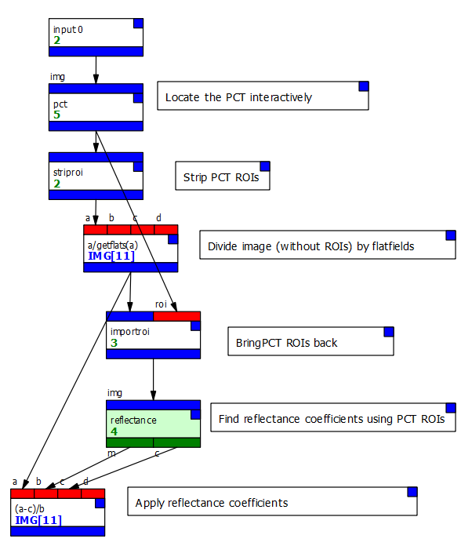
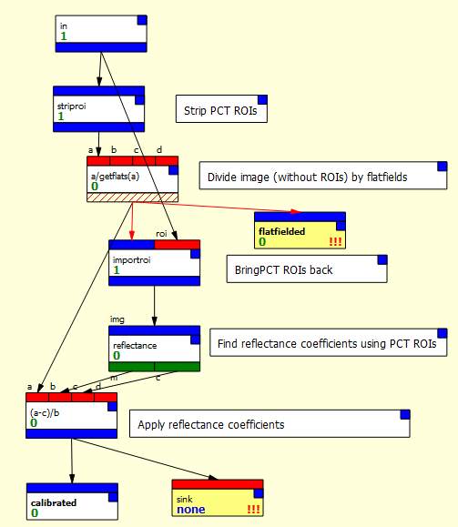
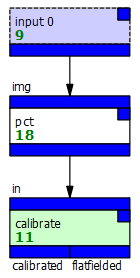
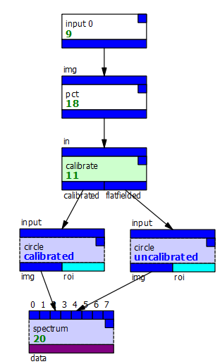
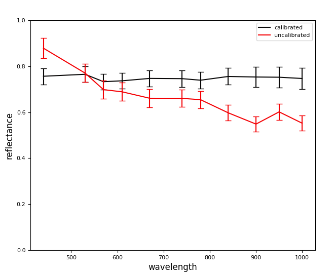

# A calibration macro example

Consider a calibration process which

* divides an image by the flatfields for the camera,
* locates the Pancam Calibration Target in the image,
* calculates the reflectance coefficients,
* calibrates the image according to those coefficients.

The problem is made slightly more complicated because we can't locate
the PCT using a node *inside* the macro, because once it's inside
we can't access its canvas or settings.

Instead, we will

* locate the PCT first,
* temporarily remove the PCT's regions of interest so the next node
will operate on the whole image,
* divide the image by the flatfields,
* bring the PCT ROIs back in using an *importroi* node,
* calculate the reflectance parameters,
* apply those parameters to the output of the flatfield calibration (without
the PCT ROIs).

That process looks something like this:

.

The majority of that process - from the *striproi* onwards - will not
need any setting changes each time we use it, and so can is a good
candidate for turning into a macro:

* We first use the File/New Macro menu option to create a new macro.
* We create a single input and set it to the "img" type.
* We create two outputs and set them to the "img" type, naming one
"calibrated" and the other "flatfielded." We'll use the first to
output the complete calibration and the second to output just the 
flatfielded data.
* We return to the main document, select all the nodes we want (everything
from *striproi*) and cut them.
* Back in the macro, we paste the nodes.
* We connect the output of the final *expr* (applying the reflectance
calibration) to the "calibrated" output
* We connect the output of the flatfielding *expr* to the other output.
* We also create a *sink* node and connect the output of the final *expr*
to it, so we can view the result in the macro's instance node.
* Finally, we rename the macro "calibrate".

The result should look like this:

Note that a lot of the node connectors are giving spurious type warnings
and that we also have warnings indicating nodes haven't run - this is 
PCOT's checking not entirely understanding how macros work internally!

We can now change our main graph to just this:

We can connect to the outputs - here I've added a couple of identical
*circle* ROIs which feed into a spectrum, but each takes its input
from a different output. That lets us see the spectra of the different
images:

The output is as you would expect:

We can now add this macro to an archive, or just import it from this
document into others.

