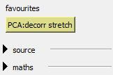
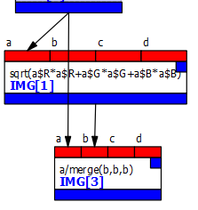
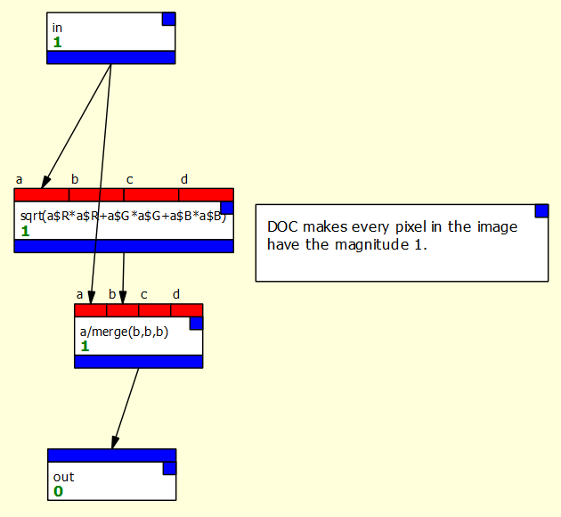
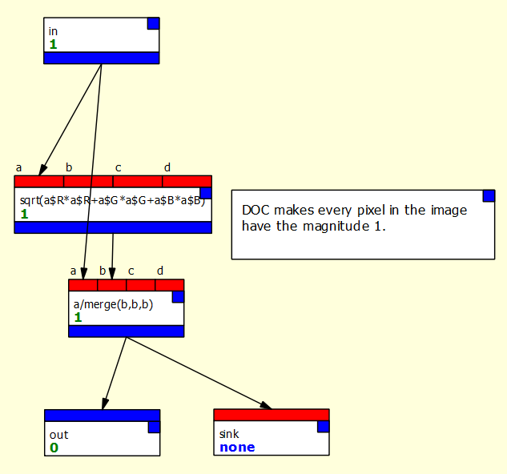
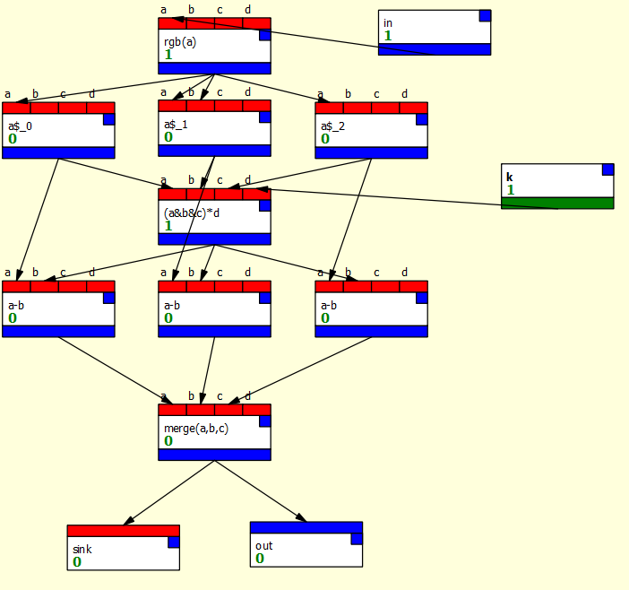
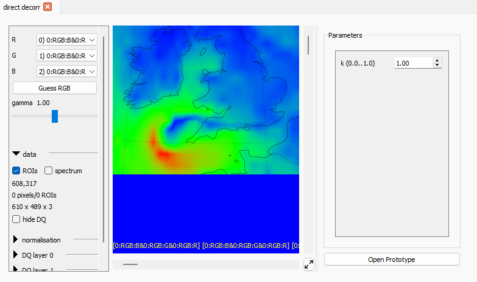

# Favourites and Macros

Favourites and macros provide two complementary ways to reuse pieces of your dataflow graphs.

* **Favourites** capture a single node together with its configuration. They are ideal for things like a commonly used expression node or a PCA node with settings you rely on.
* **Macros** package up a set of connected nodes into a single, self-contained unit. In the graph they behave like ordinary nodes, but internally they expand to the full subgraph you saved.

## Favourites

To create a favourite, right-click on a node in the graph and select
"Save as favorite" from the menu. You will be asked for a name. When
you click OK, the node and all its settings will be saved, and it will
now appear in the "favourites" section of the palette.

This section will not appear if you have no favourites, and unlike other
sections it cannot be "collapsed."

For example, if you create a PCA node and give it the standard settings
for doing a decorrelation stretch:

* set mode to "Decorrelation stretch"
* set stretch/whitening to "stretch"
* turn on "Normalize RGB output"
* turn on "Apply hist equal to RGB"

you can then right-click on the node and save it with the name "decorr stretch."
Your palette will then look like this:

Note that the favourite name includes the name of the node type automatically.

Favourites are saved with the document and can be imported into other
documents. They can also be saved in an archive which can be imported
manually or automatically (see [Importing](#below) below).

## Macros

Macros allow several connected nodes and their settings to be stored
as if they were a single node. The nodes "inside" the macro can be connected
to each other, and can also be connected to nodes outside the macro
via special connector nodes.

### An example

This is best understood by an example. Let's imagine we want to normalize
every pixel in an RGB image so that it has the magnitude 1 when considered
as a vector (that is, we're L2-normalizing the image). For each pixel:

\begin{align}
k &= \sqrt{r^2 + g^2 + b^2}\\
r' &= r/k\\
g' &= g/k\\
b' &= b/k
\end{align}

We can do that with nodes like this:

We might want to use this operation a lot, so it would be useful if it
could work like a single node type we could drag from the palette.

To do this, we need to create a macro. Once the macro is defined, we create
a new **instance** of the macro by dragging it into our graph just like 
any other node. Internally, this makes a copy of the graph (called the 
"instance graph") which runs whenever the node runs.
Any changes in the macro's **prototype** graph - the graph
defining its internals - will be reflected in its instances.

### Creating the example L2-normalization macro

It's usual to create a macro by creating its nodes in the main graph,
then cutting and pasting them into a new macro, so I'll walk you
through those steps to create the above operation as a macro:

Creating the operation as a graph:

* Create a new graph.
* Pull an RGB image into input 0 using the Input boxes,
and create the two expression nodes as in the figure above to
do the L2-norm of that image. 
    * First node: `sqrt(a$R*a$R + a$G*a$G + a$B*a$B)`
    * Second node: `a/merge(b,b,b)`

Creating the macro and its input/output connections:

* Now use the **File/New Macro** main menu option to create a new macro. This will
open a new window with a yellow background to indicate we are in a macro
prototype.
* Rename the macro with the "Rename macro" button in the global
settings area to something like "L2 norm".
* Add an input to the macro with the "Add input" button. This creates a 
special node in the prototype that brings data into the macro from the
outside. Optionally rename this node by right-clicking on it in the graph and selecting
the "Rename" option (as with renaming any node) and call it "img" or "input"
or something else useful. This text will appear next to that input on the macro
instance's node in the main graph.
* Macro inputs need to know what kind of data to expect: 
double-click the node to open it, and set its type to "img".
* Add an output to the macro with "Add output" and set its type to "img"
in a similar way.

Copying in the operation:

* Return to the main graph, select the two nodes that perform the 
operations, and cut them with Ctrl+X.
* Switch to the macro and paste the nodes with Ctrl+V.

Connecting the inputs and outputs, and adding documentation:

* Connect the macro's input node to the first input of the first *expr* node (the square root) and
to the first input of the second *expr* node (which forms the numerator of
the division).
* Connect the output of the second *expr* node to the macro's output node.
* You may also wish to add a *comment* to the
macro graph which says "DOC performs L2-normalisation on all pixels."
Any comment starting with "DOC" followed by a space will pop up
when the macro instance node's help is selected, as with any other node.

The result should look like this:

@@@ info
Note that you won't get warnings about out-of-date nodes while in a macro,
because these nodes never run - they are just copied. You also won't see bad connections
(normally marked as red arrows)
to outputs with no value (such as *expr* nodes which haven't run). Again, these nodes
will never set their output type, so such warnings would be pointless.
@@@

### Using macros

Once you have defined a macro, it will be available in the "macros"
group of the palette. This appears at the bottom of the list.
Like favourites, macro node buttons are different colour from normal
node buttons.

If you have followed the steps above, you can drag the "L2 norm" macro
into your graph and use it like any other node. It will be saved with
the document.

### Editing macros and "sink" nodes.

Once a macro has been created, it can be edited by opening its prototype
graph. You can do this by double-clicking the macro's node and selecting
"Open Prototype." Any changes made will be reflected in each macro
instance (that is, each copy of the macro that's actually running inside
the main graph).

* Open the prototype for the L2 norm macro as described above, and 
create a *sink* node (from the "utilities" group). Add this to the 
macro graph, and connect it to the output of the second *expr*.
* You should notice that the macro node's view now contains the normalised
image.

If there is a *sink* node inside the macro, its contents will show
in each instance's node view.

The macro prototype graph should look like this:

## Deleting favourites and macros

Favourites and macros can be deleted from the palette using the 
right-click menu on the relevant button. Any instances of a deleted
macro will be deleted; favourites will remain (they are nodes in their
own right).

## Importing favourites and macros

It's possible to import from other PCOT documents by using 
**File / Import Macros and Favourites** from the main menu. This will
open a file dialog. Once you have selected a file, all the macros
and favourites in that file will be shown and you can select those you 
wish to import. If that item already exists it will be skipped, so you
should delete items you wish to overwrite.

### Archives

It's often useful to build an archive of favourites and macros. You can
easily do this by creating an empty PCOT document and importing items
you like into it.

The PCOT settings also allow a list of such archives to be specified,
from which all items will automatically be imported when a new document
is created. This can be found under Locations when you open the settings
with Edit / Settings from the main menu.

## A more complex example

[This page](calib.md)
describes a more complex example which applies flatfielding
and reflectance calibration using a Pancam Calibration Target.

## Macro parameters

Sometimes macros have numerical parameters. Consider the macro
shown below, that performs a "direct decorrelation stretch" after Liu
and Moore [^1]:

\begin{align}
r' &= r - k \min(r, g, b)\\
g' &= g - k \min(r, g, b)\\
b' &= b - k \min(r, g, b)
\end{align}

This (pretty messy) macro has a parameter $k$ which is brought into
the graph by the *macro parameter* node on the right. When you open
a macro instance's node, you'll now see this parameter can be edited:

You can create a macro parameter inside a macro prototype graph thus:

* Click the the "Add parameter" button (near the add input/output buttons). This will
create a new parameter node inside the prototype.
* Right click the node, select "Rename" and change the name of your parameter.
* Double clicking on the node to open an editor to change the type, description,
range and default value. Parameters can be integer or float.

[^1]:
Liu, J.G., and Moore, J. (1996) Direct decorrelation stretch technique for RGB colour composition. International Journal of Remote Sensing, 17:5, 1005-1018.

