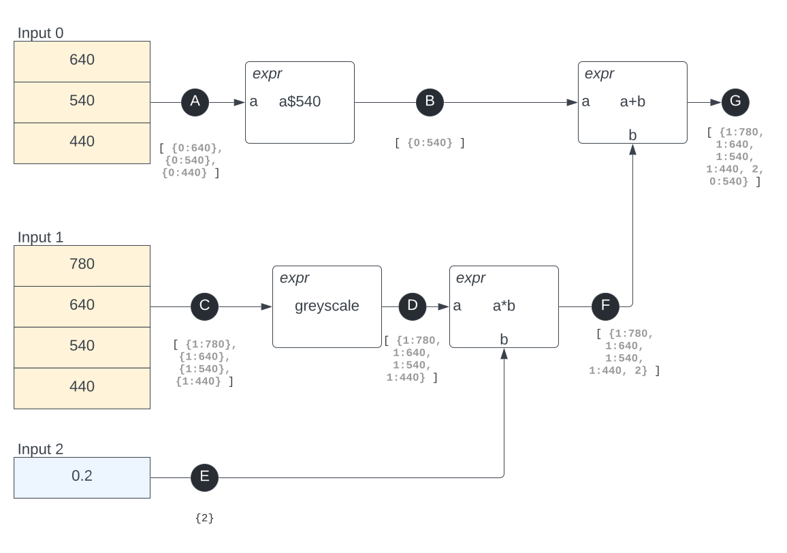

# Operating principles

PCOT nodes need to follow a set of rules to ensure that the information
they process is handled consistently. This page describes these rules,
most of which apply to image data.

## Source handling rules
Each datum handled by PCOT has a "source set" describing where that
datum ultimately comes from. Sources vary: in images, each band in an input image carries
a source datum describing where it comes from. For a PDS4 source it could be a LIDVID, or it
could simply be a filename (although ideally it should have some archive indexing data).

Because data can be combined in various ways, each datum could have multiple
sources. Image data in PCOT have a separate source set for each band. 

The rules for sources are simple:

* Every datum has a source set.
* This may be a null source if the datum is generated internally (consider the output from *constant* nodes).
* In the case of an image, this source set is actually a separate source set for each band, but may still be considered as a single
source set for some operations (since the union of the band sets is available).
* If a datum, or band in a multi-band image, is constructed from data from more than once source set, the resulting datum or band
consists of the union of the sets.


As an example, consider the rather contrived example below. Here,

* each datum is marked as a black circle below which is a description of the the sources - there's more explanation of this below.
* image inputs are in yellow
* scalar inputs are in blue
* nodes are white rectangles
* *expr* nodes (which calculate mathematical expressions) are marked as
such with the expression being the main text



We have three inputs into the graph:

* Input 0 has an image with three bands centered on 640nm, 540nm and 440nm.
* Input 1 has a different image with four bands.
* Input 2 has a numeric value of 0.2 (perhaps a housekeeping datum of some kind).

These data are then combined in various ways:

* Input 1 is converted to a single greyscale band and multiplied by input 2 (the scalar 0.2)
* The result of this operation is then added to the 540nm band of input 0.

What do the sources look like for each datum?

* Datum A is an image, and as such it has one source set per band. Each source
set consists of a single source, with details of input and filter
wavelength. So here, the sources for A could be written as

        [ {0:640}, {0:540}, {0:440} ]

    That is, a list of three sets, each of which contains a single source which I've written
    in the form ```input:wavelength```.
    
* Datum B is the extracted 540nm band of input A, so its sources are:

        [ {0:540} ]

* Datum C is another multiband image, this time from input 1:

        [ {1:780}, {1:640}, {1:540}, {1:440} ]

* Datum D is the greyscale conversion of Datum C above. This creates a single-band image,
but that band combines all the bands of datum C. This results in a single source set containing
all the bands:

        [ {1:780, 1:640, 1:540, 1:440} ]
        
* Datum E is the only non-image source. I will denote it here as just "2" indicating that it
is input 2. It is worth noting here that sources may contain a lot of extra data describing
exactly where they come from. For example, this input may come from PDS4, in which case at least
the LIDVID will be included. But for now this is simply

        {2}
        
    Note that this is not shown as a list because it is not a multiband source.


* Datum F multiplies each band in datum D by the scalar E. This means that the source for E must
be added to the source set for each band. There is only one band at this point because of the 
greyscale conversion:

        [ {1:780, 1:640, 1:540, 1:440, 2} ]
        
* Finally, we add the single-band images B and F together, resulting in another single-band image.
This addition is done bandwise. There is only one band, so the result is:

        [ {1:780, 1:640, 1:540, 1:440, 2, 0:540} ]

## ROI rules

Images may contain regions of interest. If this is the case, then 
any operation should only be performed on the region of interest if possible.
However, the rest of the image should be passed through unchanged to
provide context - it is always possible to use a *croproi* node before
the operation if cropping is required.

This rule has the following practical outcomes, in which images are denoted
by capitals $A, B, \dots$ and scalars are denoted by lowercase $x, y. \dots$

So:

* In binary operations on an image and a scalar such as $x+A$ or $A+x$, the
operation is only performed on the region covered by the union of all
ROIs on $A$. Other parts of $A$ are left unchanged in the output,
which carries the same ROIs.

* In binary operations on two images $A+B$ etc., there should be only one set of ROIs
in operation. This means that either only one image has an ROI, or the sets of ROIs for
both images are identical.

Outside the ROI, the image pixels are taken from the left-hand side of the operator
as shown in the figure below.


@@@info
Originally the rule was that the intersection of the unions of the ROIs would
be processed, while the rest of the output would be from the left-hand side
(in the case of image data). That was too complicated, and broke the
"principle of least astonishment." If the user has put different ROIs on both sides of
their image they have probably made a mistake. However, it's quite possible
for the same ROIs to be on both sides of an expression if they were derived from the same
image.
@@@

## Quality data 
All values in PCOT - scalar and image - can have an uncertainty value and data quality (DQ) bits.
In imagecubes, this applies to every pixel of every band. The uncertainty values are expressed
as standard deviations. Operations need to combine these data in a sensible way.

@@@warn
Note that the standard deviation used is the **population** standard
deviation, not the **sample** standard deviation.
@@@

This is currently implemented using the **Value** class.

Consists of:

* image uncertainty map (float per band)
* image quality/info bits (uint16 per band)

### Uncertainty

Uncertainty values are propagated through calculations in the *expr* node and elsewhere according to
these rules:

\begin{align}
\sigma(a+b), \quad \sigma(a-b) &= \sqrt{\sigma^2 a + \sigma^2 b}\\
\sigma(ab) &= |ab| \sqrt{\left(\frac{\sigma a}{a}\right)^2+\left(\frac{\sigma b}{b}\right)^2} \\
&= \sqrt{a^2 \sigma^2 b + b^2 \sigma^2 a}\quad \text{when all values positive}\\
\sigma(a/b) &= \left|\frac{a}{b}\right| \sqrt{\left(\frac{\sigma a}{a}\right)^2+\left(\frac{\sigma b}{b}\right)^2} \\
&= \frac{\sqrt{a^2 \sigma^2 b + b^2 \sigma^2 a}}{b^2}\quad \text{when all values positive}\\
\sigma(a^b) &= \sqrt{ (a^{b-1} b \sigma a)^2 + (a^b \log a \sigma b)^2} \\
&= \sqrt{a^{2b-2} ((a \sigma b \log a)^2 + (b \sigma a)^2)}\\
\sigma (a \& b) &= \min (\sigma a, \sigma b)\\
\sigma (a | b) &= \max (\sigma a, \sigma b)
\end{align}

@@@ warning
Remember that generally these rules only apply if the bands are independent. In reality there
is always a covariance between them, but we have to ignore that.
@@@


**Not all images contain uncertainty data** - it may be that the input
image doesn't have this data, or that a function has been performed on the
image which does not permit uncertainty data to be carried through
(consider a decorrelation stretch, for example). **This
can be viewed** by selecting the **nounc** (no uncertainty) bit for viewing in the [canvas](canvas.md).

### DQ bits

Each scalar, or band value for each pixel, has an associated set of bits which indicate error states, etc. 

Bits are currently:

| Bit name | Meaning | Effect on calculations (see notes below)|
|-----------|------|----|
|**NODATA**|There is no data here|BAD|
|**SAT**|Pixel is saturated high in this band|BAD|
|**DIVZERO**|The data is the result of a division by zero|BAD|
|**UNDEF**|The data is the result of an undefined operation|BAD|
|**COMPLEX**|The data is a complex number likely to be undefined (or just the real part)|BAD|
|**ERROR**|There is an unspecified error in this data|BAD|
|**ZERO**|This data is zero||
|NOUNCERTAINTY|There is no uncertainty data||

All bits are propagated into the data generated from the data they are attached to. 
**BAD** means that the data in these pixels should not be
considered. While calculations will still be done on BAD data, the BAD bits will be propagated. In the case
of nodes which generate a scalar from images, such as finding the mean or SD of a set of pixels (or similar operations in the 
*spectrum* node) the pixels marked BAD should be ignored.

* It is possible to set bits based on per-pixel conditions with the *dqmod* node. For example, convert all uncertainties
greater than a given value into errors. 

* It is possible to convert DQ bits into regions of interest using the *roidq* node, with the region being made up of
pixels for which certain bits are absent or present. This can be done looking at all bands or just one.

* In general, when multiple image bands
are combined (either from the same image or from different images) these are OR-ed together. This typically happens in a band-wise fashion
because images are combined band-wise. Thus, when two images $a$ and $b$ are
added, and the bits for channel $i$ of image $a$ are $B_i(a)$,

\\[
B_i(a+b) = B_i(a) \vee B_i(b)\quad \text{for all channels } i
\\]

* However, some operations have a more complex flow of information. For example, a decorrelation stretch results in information from all
bands being used in each band. In cases like this, the resulting bands are all ORed toether:
\\[
B_i(\text{decorr}(a)) = \bigvee_i B_i(a)
\\]

### <font color="red">UNIMPLEMENTED BIT OPERATIONS</font> 
* Nodes which perform a convolution operation or similar should propagate the error pixel to all affected pixels, leading to a blob of pixels in the output.
I realise **This isn't ideal**; another possibility could be to just zero the mask? But then we lose the error data. At the moment I don't believe we have any
"non-local" behaviour where pixels affect regions of pixels in the output, so the point could be moot.

## Filter aberration <font color="red">UNIMPLEMENTED</font>

The filter wavelengths are only accurate for pixels in the centre of the image, due to the difference in the light path through the filter
at different angles of incidence. Therefore:

* There will be a system in place to calculate the actual filter wavelength for a given pixel and use this in spectral plots (using the centre
of the ROI for the *spectrum* node)
* A function should be available to generate the filter aberration value in *expr* - this would allow an "image" to be made of
the aberration value which could be used in calculations
* It should be possible to set the ERROR bit for excessive aberration values


## Canvas information <font color="red">UNIMPLEMENTED</font>

The following should be visible in the canvas as optional overlays:

* Filter aberration as a heat map (default OFF)
