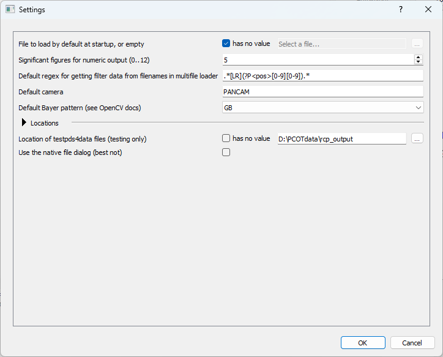
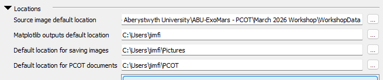
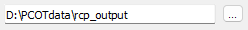
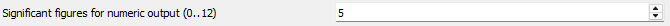
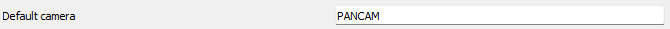
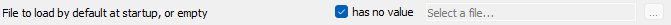
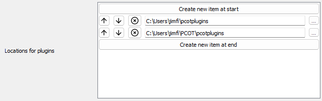

# The settings dialog

This dialog can be opened with the Settings option in Edit menu
on the main window. It contains global settings for PCOT, which
are common to all documents.

These are saved in a file called `pcot_config.yaml` in the user's
home directory.

## Sections, and types of value

Some settings are inside subsections, which can be opened and closed by clicking on the arrow:

There are several different types of setting, each of which are discussed below.

### Simple types

**file or directory values** appear as text boxes with a button to open a file or directory dialog: 

{.img-inline}

**numeric values** appear as a "spin box"; you can either type the value or use the up/down buttons.
The caption gives the range of acceptable values:

{.img-inline}

**text values** are just a text box:

{.img-inline}

### Nullable values

Some settings can have a special "null" value - in other words, they might not have a value at all.
A good example is the file to load at startup. Such values have a box next to them. When this is checked,
the setting has no value, and the associated control (one of the simple types described above) is disabled.
Any value stored in that control will not be used and will not be saved until the box is unchecked.

{.img-inline}

### List types

Some settings consist of lists of values, as shown below.

Each individual value is one of the types discussed above. Values can be removed by clicking the cross or moved towards
the start or end of the list using the buttons. New values can be created at either end using the appropriate buttons,
and will be set to appropriate defaults.

## Settings

Most of these settings are dealt with elsewhere in the documentation, but
I'll cover a few here:

* **File to load at startup** is a PCOT file automatically opened when
PCOT starts, which is useful if you are only working on one particular
script for the time being.
* **Default regex for getting filter data** is used by the [Multifile loader](multifile.md) to work out
which filter is being used for a particular image from the filename.
* **Default camera** is the default camera to set in the multifile loader and elsewhere. We don't check that the camera actually exists
in the cameras directory, so make sure you get this right if you use it.
* **Default Bayer pattern** specifies the Bayer pattern to use to debayer (demosaic) colour images.

In the Locations section:

* **Locations for plugins** is a list of directories scanned for PCOT plugin files.
* **List of macro and favourite archives** is a list of PCOT files which have all their [favourites and macros](favesandmacros/index.md)
imported automatically when a new document is created.

